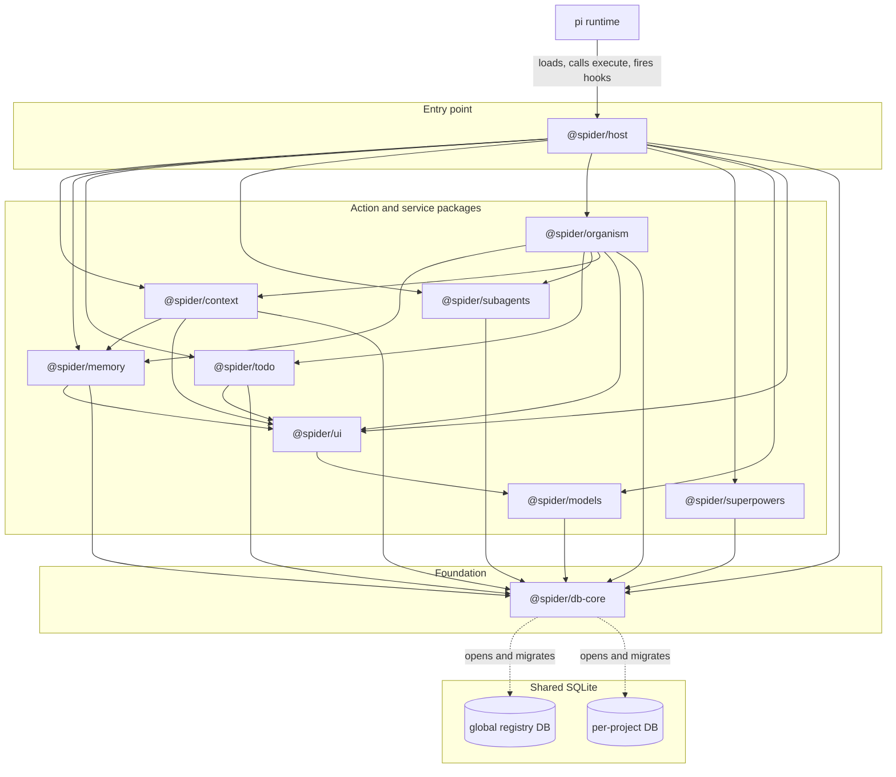
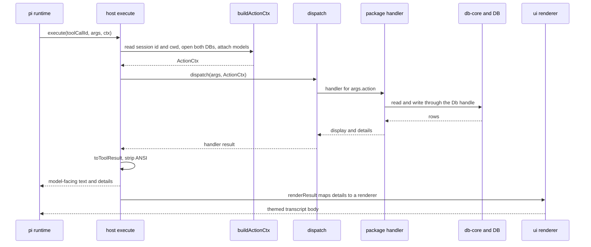

# Architecture overview

Spider is one pi coding-agent extension. It puts memory, unified search, todos,
subagents, sandboxed execution, web fetch, and a skills library on a single
shared SQLite database. This document describes the shape of the system: the
single tool the agent calls, the layered packages behind it, the database they
all share, and the path one call takes from a tool invocation to a rendered
result.

For the tables those packages read and write, see
[`data-model.md`](./data-model.md). For the feedback and learning loops that run
on top of them, see
[`feedback-and-learning-loops.md`](./feedback-and-learning-loops.md). This
document does not repeat either one.

## The one-tool model

The agent has one tool, named `spider`. Every operation is an `action` on that
tool: `search`, `remember`, `recall`, `exec`, `exec_file`, `batch`, `index`,
`fetch`, `run`, `todo`, `skill`, `import`, `message`, and `control`. The tool
definition, its parameter schema, and the list of valid actions live in
`@spider/host` (`extension.ts` for the schema, `dispatch.ts` for the validated
action set).

`control` is a second level of routing for admin surfaces. `spider control
<command>` reaches `doctor`, `config`, `memory`, `stats`, `models`, `insights`,
`migrate`, `skill curate`, and `upstream-watch`. The `control` handler lives in
host because it spans several packages.

Slash commands are a thin front for the same actions. `/todos` and `/agents`
open live overlays; `/spider`, `/search`, `/memory`, `/insights`, `/learn`,
`/doctor`, and `/stats` forward to `dispatch` and render through the same
renderers a tool result uses, so a slash result and the matching tool result
look identical.

## Layered package structure

Ten packages sit in a dependency order, leaves first. A package only imports
from packages below it.

| Layer | Package | Role |
| --- | --- | --- |
| Foundation | `@spider/db-core` | Opens and migrates the three database tiers, defines the schema, resolves a project, and runs the `run_events` bus. No `@spider/*` dependency. |
| Model routing | `@spider/models` | Model catalog, tiers, selection, and one-shot completion. Depends on `db-core` for the `Db` type only. |
| Rendering | `@spider/ui` | Pure themed renderers and TUI components. Takes plain data and a theme, returns strings. Depends only on `@spider/models` types. Touches no database and does not import pi. |
| Action and service | `@spider/memory` | Structured memory: staging, approval, the active snapshot, embeddings. Depends on `db-core` and `ui`. |
| Action and service | `@spider/todo` | Durable per-session todos and the `/todos` surface. Depends on `db-core` and `ui`. |
| Action and service | `@spider/context` | Unified search, sandboxed exec, the content store, fetch, and session import. Depends on `db-core`, `memory`, and `ui`. |
| Action and service | `@spider/subagents` | Subagent dispatch in single, chain, parallel, and pipeline modes, plus intercom. Depends on `db-core`. |
| Action and service | `@spider/organism` | The drain, passes, curator, and learning graph. Depends on `db-core`, `memory`, `todo`, `subagents`, `context`, and `ui`. |
| Action and service | `@spider/superpowers` | The vendored skills library, the managed `AGENTS.md` block, and upstream-watch. Depends on `db-core`. |
| Entry point | `@spider/host` | The pi extension pi loads. Registers the `spider` tool, dispatches each action, renders results, and wires slash commands, hooks, routing, and the agents UI. Depends on every other package. |

Two properties hold this together. `@spider/ui` is a set of pure functions: it
never opens a database and never calls the pi API, so any package can render
without pulling in storage or the host. `@spider/host` is the only package that
depends on pi; nothing in the monorepo depends on host. The action and service
packages do not call each other to fetch data. They read and write shared tables
through the `Db` handle `db-core` returns, which is what makes the database the
integration point rather than any single package.

## The shared database

There are three database tiers, all owned by `@spider/db-core`. The tier a table
lives in is decided by what the data outlives:

- A **global** registry at `~/.pi/agent/spider/spider.db`. It tracks every
  project spider has seen, plus session bindings, the message queue, insights,
  and model stats.
- A **repo** database at `<git-common-dir>/spider/repo.db`. It holds `memory`,
  skills, and curator state — shared by every worktree of the same repository,
  so a convention learned in one worktree is known in its siblings.
- A **worktree** database at `<worktree-root>/.spider/project.db`. It holds that
  worktree's sessions, todos, indexed content, runs, event log, and embedding
  state.

A project is keyed by its **worktree root**, not by the git common directory.
Keying by the common directory made every worktree of a repo collide on one
registry row while each wrote its own `db_path`, so opening one worktree
rewrote another's. Non-git directories fall back to the worktree tier.

Every package that reads or writes data opens a connection through `db-core`
(`resolveProject`, `openGlobal`, `openRepo`, `openProject`, `openDbAt`) and works
against the returned handle. Note that `openRepo` takes a **git common dir**, not
a working directory. Packages coordinate by writing rows one reads later, not by
calling each other. Content the routing loop indexes, memory the write pipeline
stages, runs the subagent dispatcher records, and summaries the organism writes
are all retrievable through `spider search`. The schema, the migration ladder,
and the `run_events` bus are documented in [`data-model.md`](./data-model.md).

## Master interaction diagram

The diagram shows the ten packages, the three database tiers, and the pi runtime. Solid
arrows are dependency edges (a package imports the one it points to). The dotted
edges are the data path: `db-core` opens and migrates both databases, and every
storage-touching package reaches those databases through the handle it returns.

## How one call flows

A single `spider` tool call runs through host, into a package handler, and back
through a renderer. The steps below match `execute` in
`packages/host/src/extension.ts` and `dispatch` in
`packages/host/src/dispatch.ts`.

1. pi calls the tool's `execute(toolCallId, args, signal, onUpdate, ctx)`.
2. `execute` reads the session id and working directory from the pi context
   (`sessionIdOf`, `cwdOf`), then calls `buildActionCtx`. That resolves the
   project, opens the per-project and global databases through `db-core`, and
   attaches the `@spider/models` router. The result is one `ActionCtx` for this
   dispatch, carrying `db`, `globalDb`, `project`, `sessionId`, `cwd`, `pi`, and
   `models`.
3. `dispatch(args, ctx)` validates `args.action` against the known set and looks
   up the handler registered for it. Handlers register through `registerAction`:
   `@spider/context` registers `exec`, `exec_file`, `batch`, `index`, `fetch`,
   `search`, and `import`; `@spider/subagents` registers `run` and `message`;
   `@spider/memory`'s logic backs `remember` and `recall`; `@spider/todo` backs
   `todo`; `@spider/organism` backs `skill`; and host itself owns `control`.
4. The handler runs against the context databases through the `db-core` handle
   and returns a loose shape (`{ text?, display?, details?, error? }`).
5. `toToolResult` normalizes that return into pi's tool result: a model-facing
   text block with ANSI stripped, plus the structured `details` payload. This is
   what the model sees. No `@spider/ui` component reaches the model text.
6. Separately, `renderSpiderResult` maps `details` to a `@spider/ui` renderer to
   build the themed transcript body, and `renderSpiderCall` renders the
   in-progress call title.

Slash commands run the same `dispatch` path and render through the same
`renderSpiderResult` by way of the `spider.command` message renderer.

Two paths sit outside this per-call flow. Host registers pi lifecycle hooks
(memory snapshot injection on `before_agent_start`, session upsert on
`session_start`, skill-path contribution on `resources_discover`, and the
organism drain on compact and shutdown), and a routing layer over every
non-spider tool call that scrubs secrets, scans for injection, and auto-indexes
large output. Those, together with the subagent and learning loops, are
described in [`feedback-and-learning-loops.md`](./feedback-and-learning-loops.md).

## See also

- [`data-model.md`](./data-model.md): the three database tiers, the tables, migrations,
  and the `run_events` bus.
- [`feedback-and-learning-loops.md`](./feedback-and-learning-loops.md): the
  routing, memory, organism, and subagent loops that run on the shared database.
- [`../../packages/db-core/README.md`](../../packages/db-core/README.md)
- [`../../packages/models/README.md`](../../packages/models/README.md)
- [`../../packages/memory/README.md`](../../packages/memory/README.md)
- [`../../packages/todo/README.md`](../../packages/todo/README.md)
- [`../../packages/context/README.md`](../../packages/context/README.md)
- [`../../packages/subagents/README.md`](../../packages/subagents/README.md)
- [`../../packages/organism/README.md`](../../packages/organism/README.md)
- [`../../packages/superpowers/README.md`](../../packages/superpowers/README.md)
- [`../../packages/ui/README.md`](../../packages/ui/README.md)
- [`../../packages/host/README.md`](../../packages/host/README.md)
