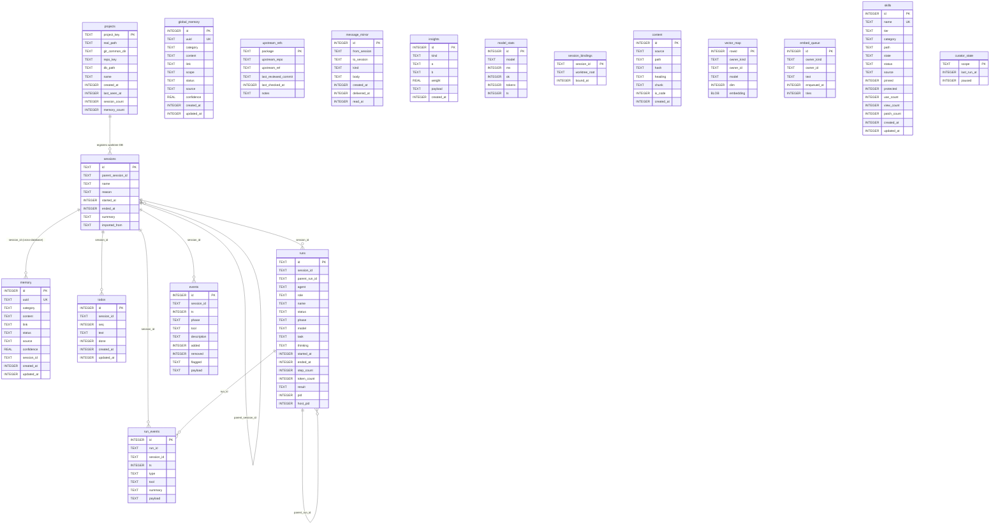

# Data model

Spider stores everything in SQLite. There are **three** kinds of database:

- A **global registry database** at `~/.pi/agent/spider/spider.db`. It tracks
  every project spider has seen, holds global-scope memory and a few
  cross-session tables, and records session-to-worktree bindings (`/bind`). It
  does **not** hold skills or the day-to-day `memory` table — see below.
- A **repo database** at `<git-common-dir>/spider/repo.db`. It holds `memory`,
  skills bookkeeping, and curator state — shared by every worktree of the same
  repository, so a note or skill learned in one worktree is visible from its
  siblings. Keyed by the git common directory, not by any one worktree.
- A **worktree database** at `<worktree-root>/.spider/project.db`. It holds
  that one worktree's sessions, todos, indexed content, runs, event log, and
  its own embedding state. Keyed by the worktree's root directory, so two
  worktrees of the same repo never share this database.

`@spider/db-core` owns all three. It defines the schema, applies migrations,
resolves which files a working directory maps to, and provides the event
helpers. Every other package that reads or writes data opens a connection
through `db-core` and works against the `Db` handle it returns.

The schema is defined as three DDL strings in `packages/db-core/src/schema.ts`:
`GLOBAL_SCHEMA`, `REPO_SCHEMA`, and `WORKTREE_SCHEMA`. There is no
`PROJECT_SCHEMA` symbol — that was the pre-split name, and the tiering split
(schema version 7) divided it into `REPO_SCHEMA` (which took `memory`, `skills`,
`curator_state`) and `WORKTREE_SCHEMA` (which kept `sessions`, `content`,
`todos`, `runs`, `run_events`, `events`). `migrate.ts`'s comments reference
`PROJECT_SCHEMA` only as history, in migration steps named for what they split
away from. Table and column names in the three DDL strings are canonical.

`"project"` is a **deprecated alias for `"worktree"`**, not a fourth tier. Both
`migrate(db, scope)` and `paths.ts`'s internal `rootFor` map `scope === "project"`
to the same behavior as `"worktree"`; nothing reads or writes a database keyed
by the literal scope `"project"` differently from `"worktree"`. It exists so
older call sites that pass `"project"` keep compiling and working.

## Three databases, one process

A working session can touch all three databases. The global database answers
"which project (worktree) am I in, and where are its files" and stores memory
scoped to `global`. The repo database stores state that should survive deleting
any one worktree and be visible from the others. The worktree database stores
records private to the current checkout. The `projects` table in the global
database is the index: each row records a worktree's key, its real path, its
git common directory (`repo_key`), and the absolute path of its `project.db`
file.

Relationships inside the schema are by column convention, not declared foreign
keys. The DDL sets `foreign_keys = ON` at the connection level but does not add
`REFERENCES` clauses, so columns like `session_id`, `run_id`, and
`parent_run_id` link rows by value without database-enforced constraints — and,
since the tiering split, some of those conventional links now cross database
files entirely (a worktree-tier `sessions.id` and a repo-tier `memory.session_id`
live in different `.db` files).

## Entity relationship diagram

The diagram below shows the main tables across all three databases. `projects`,
`global_memory`, `upstream_refs`, `message_mirror`, `insights`, `model_stats`,
and `session_bindings` live in the **global** registry database. `memory` and
`skills`/`curator_state` live in the **repo** database. `sessions`, `content`,
`todos`, `runs`, `run_events`, and `events` live in the **worktree** database.
`vector_map` and `embed_queue` are defined **twice** — once in `REPO_SCHEMA` and
once in `WORKTREE_SCHEMA` — as two separate tables with identical structure in
two separate files (repo-tier embeddings for `memory`; worktree-tier embeddings
for `content` and whatever else that worktree embeds), shown once below for
brevity. The link from `projects` to `sessions` is logical, same as before the
split: a `projects` row names the file that contains those `sessions` rows, not
a row-level foreign key — and the `sessions`-to-`memory` link is now a logical
cross-database link for the same reason.

## Global registry database

`GLOBAL_SCHEMA` defines seven tables.

| Table | Holds |
| --- | --- |
| `projects` | One row per worktree spider has resolved. Columns: `project_key` (primary key, the worktree root), `real_path`, `git_common_dir`, `repo_key` (the git common directory, used to open the repo-tier database), `db_path` (absolute path of the worktree's `project.db`), `name`, `created_at`, `last_seen_at`, and the counters `session_count` and `memory_count`. |
| `global_memory` | Memory scoped to `global`. Columns include `uuid` (unique), `category`, `content`, `link`, `scope` (default `global`), `status` (default `active`), `source` (default `user`), `confidence`, and timestamps. |
| `upstream_refs` | Tracking rows for vendored subsystems, keyed by `package`, with `upstream_repo`, `upstream_ref`, `last_reviewed_commit`, `last_checked_at`, and `notes`. |
| `message_mirror` | A cross-session message log: `from_session`, `to_session`, `kind`, `body`, `created_at`, plus `delivered_at` and `read_at` (both nullable, set once a queued message is actually delivered/read). |
| `insights` | Derived observations: `kind`, a pair of endpoints `a` and `b`, a `weight`, a JSON `payload`, and `created_at`. |
| `model_stats` | Per-call model timing and outcome rows: `model`, `ms`, `ok`, `tokens`, `ts`. |
| `session_bindings` | One row per bound session: `session_id` (primary key), `worktree_root`, `bound_at`. Backs `/bind`; read and written by `getBinding`/`bindSession`/`unbindSession` in `bindings.ts`. |

## Repo database

`REPO_SCHEMA` defines the tables shared by every worktree of one repository,
plus one FTS5 companion.

| Table | Holds |
| --- | --- |
| `memory` | Repo-scoped structured memory: `uuid` (unique), `category`, `content`, `link`, `status` (default `active`), `source` (default `user`), `confidence`, `session_id` (a worktree-tier session id, linked by convention only), and timestamps. |
| `memory_fts` | FTS5 companion over memory `category`, `content`, and `link` (`uuid` is unindexed). |
| `vector_map` | Embedding storage for this repo database (see [Vector storage](#vector-storage)). |
| `embed_queue` | Pending embedding work for this repo database. |
| `skills` | Skill bookkeeping: `name` (unique), `tier` (defaults to the literal string `'project'` in the DDL — a pre-tiering default that was not renamed when the scope vocabulary changed to `global`/`repo`/`worktree`), `category`, `path`, `state`, `status`, `source`, `pinned`, `protected`, use/view/patch counters, last-used/viewed/patched timestamps, `candidate_body`, `related`, and timestamps. An index `idx_skills_state` covers `(state, status)`. |
| `curator_state` | One row per `scope`: `last_run_at` and a `paused` flag. |

## Worktree database

`WORKTREE_SCHEMA` defines the tables private to one worktree checkout, plus
their FTS5 companions.

| Table | Holds |
| --- | --- |
| `sessions` | One row per pi session in this worktree: `id` (primary key), `parent_session_id`, `name`, `reason`, `started_at`, `ended_at`, `summary`, `imported_from`. |
| `content` | Indexed and fetched content chunks: `source`, `path`, `hash`, `heading`, `chunk` text, an `is_code` flag, and `created_at`. |
| `todos` | Durable todos: `session_id`, `seq`, `text`, a `done` flag, and timestamps. |
| `runs` | Subagent runs: `id` (primary key), `session_id`, `parent_run_id`, `agent`, `role`, `name`, `status`, `phase`, `model`, `task`, `thinking`, timing, `step_count`, `token_count`, `result`, and `pid`/`host_pid` (the subagent's process id and the host pid that spawned it, used to let an orphaned background run survive and later be reaped safely). |
| `run_events` | The append-only run event stream: `run_id`, `session_id`, `ts`, `type`, `tool`, `summary`, and a JSON `payload`. |
| `events` | The routing and tracking event log: `session_id`, `ts`, `phase` (`before` or `after`), `tool`, `description`, `added`, `removed`, `flagged`, `payload`. |
| `vector_map` | Embedding storage for this worktree database — a separate table instance from the repo database's `vector_map` (see [Vector storage](#vector-storage)). |
| `embed_queue` | Pending embedding work for this worktree database, likewise a separate instance from the repo database's. |

### Full-text search companions

Four FTS5 virtual tables mirror text columns for full-text search, one per
database that has text worth searching:

- `memory_fts` (repo database) over memory `category`, `content`, and `link`.
- `sessions_fts` (worktree database) over session `name`, `summary`, and
  `content`.
- `content_fts` (worktree database) over content `source`, `heading`, and
  `chunk`.
- `todos_fts` (worktree database) over todo `text`, defined as an
  external-content table (`content=todos, content_rowid=id`) so it stays in
  sync with `todos`.

### Vector storage

Embeddings live in two places, and both are separate from the FTS tables. Both
kinds exist **once per database that needs them** — the repo database has its
own `vector_map`/`embed_queue` for `memory` embeddings, and the worktree
database has its own, separate `vector_map`/`embed_queue` for `content` and
other worktree-scoped embeddings. The global database has neither table.

- `vector_map` is a plain table with a BLOB column. It stores each embedding as
  raw little-endian `float32` values alongside the owning row's kind and id, the
  model that produced it, and the dimension. This form supports brute-force
  cosine similarity and lets spider re-embed from the source text.
- A `vec0` virtual table named `vectors` provides indexed vector search. It is
  not part of `REPO_SCHEMA` or `WORKTREE_SCHEMA` — it is not a static DDL table
  at all. `Db.loadVec()` creates it on demand with
  `CREATE VIRTUAL TABLE IF NOT EXISTS vectors USING vec0(embedding float[384])`,
  loading the `sqlite-vec` extension the first time it runs on a given
  connection. Later calls on the same connection are no-ops.

## Migrations and user_version

The schema version is `SCHEMA_VERSION = 9`, defined in
`packages/db-core/src/migrate.ts`. Each database records its own version in the
SQLite `user_version` pragma, and `migrate(db, scope)` accepts `scope` values
`"global"`, `"repo"`, `"worktree"`, or the deprecated alias `"project"` (mapped
to `"worktree"` before anything else runs).

`migrate` reads `user_version` and does nothing if it already equals or exceeds
`SCHEMA_VERSION`. Otherwise it runs one transaction:

- **Fresh database (`user_version` 0).** It applies the full DDL for the scope
  (`GLOBAL_SCHEMA`, `REPO_SCHEMA`, or `WORKTREE_SCHEMA`). The full schema
  already includes every column, so a fresh database never needs the
  incremental steps.
- **Existing database (`user_version` between 1 and `SCHEMA_VERSION - 1`).** It
  walks each version from `current + 1` up to `SCHEMA_VERSION` and applies that
  version's incremental steps, keyed by database kind
  (`GLOBAL_MIGRATIONS` / `REPO_MIGRATIONS` / `WORKTREE_MIGRATIONS`), defaulting
  to no steps for a version that added nothing to that particular database.

The version history, as currently defined:

- **Global:** v5 adds `message_mirror.delivered_at`/`read_at` and an index; v6
  adds `projects.repo_key`; v9 creates `session_bindings` for databases that
  predate it (a fresh global database already has the table from
  `GLOBAL_SCHEMA`, so this step exists only for upgrades — it is deliberately
  keyed at 9, not 8, so that a database already at `user_version` 8 is not
  skipped by the `current >= SCHEMA_VERSION` early return and left permanently
  missing the table).
- **Repo:** v7 is the tiering split itself — the repo database starts existing,
  taking `memory`, `skills`, and `curator_state` off what used to be the
  per-project database (no DDL runs at v7 for repo scope; a v7 repo database is
  created fresh via `REPO_SCHEMA` instead). v8 creates `memory_fts` if it is
  missing and repopulates it from `memory`, repairing repo databases that an
  earlier build had stamped as v7 without ever creating the FTS table.
- **Worktree:** v2 adds `runs.thinking`; v3 is the point skills moved out to the
  repo tier (no DDL for worktree scope at v3); v4 adds `runs.pid` and
  `runs.host_pid`; v7 is the tiering split for this side — `sessions`,
  `content`, `todos`, `runs`, and `events` stay, `memory` and `skills` leave (no
  DDL runs at v7 for worktree scope either, for the same reason as repo's v7).

After the steps for a version run, `migrate` sets `user_version` to
`SCHEMA_VERSION`.

## The event bus

`packages/db-core/src/events.ts` provides two append helpers and an in-process
publish/subscribe bus. Both `run_events` and `events` are worktree-tier tables.

- `appendRunEvent(db, e)` inserts one row into `run_events` and emits the same
  event on `bus`. A `RunEvent` carries `runId`, `sessionId`, `ts`, `type`,
  `tool`, `summary`, and an arbitrary `payload` that is JSON-serialized on write.
- `appendEvent(db, e)` inserts one row into `events` (the routing and tracking
  log) and emits a derived event on `bus`. The emitted `type` is `tool_intent`
  when `phase` is `before` and `tool_result` when `phase` is `after`.
- `bus.on(listener)` subscribes and returns an unsubscribe function.
  `bus.emit(event)` calls every listener. A listener that throws is caught so
  one bad listener does not stop the others.

Read helpers cover the tracking log: `listEvents(db, opts?)` returns rows
filtered by `tool` and/or `phase` with an optional `limit`, and
`eventCountsByTool(db)` returns per-tool counts.

The bus is per process and in memory. It is not persisted; the persistence is the
`run_events` and `events` tables themselves.

## Path resolution

`packages/db-core/src/paths.ts` computes the on-disk locations.

- The global root is `~/.pi/agent/spider`. The registry database is
  `spider.db` inside it, and cached models live under `models`.
- `worktreeRoot(cwd)` resolves `git rev-parse --show-toplevel` from `cwd`,
  falling back to `cwd`'s own real path when `cwd` is not inside a git repo (or
  git is unavailable). A worktree root's data directory is
  `<worktree-root>/.spider` (`projectRoot(cwd)`); the worktree database is
  `project.db` inside it. This directory is keyed by the worktree root, not the
  literal `cwd` passed in, so running from a subdirectory of a worktree still
  resolves to the same `.spider`.
- `repoRoot(cwd)` resolves `git rev-parse --git-common-dir` from `cwd` and
  returns `<git-common-dir>/spider`, or `undefined` outside a git repo. The repo
  database is `repo.db` inside that directory, opened via `openRepo(repoKey)`
  in `registry.ts` — which takes an already-resolved repo key (the git common
  dir) and does not itself decide what to do when there isn't one.
- `paths.scratch(scope, cwd?)` and `paths.logs(scope, cwd?)` return the
  `scratch` and `logs` subdirectories of the matching root. Non-global scopes
  require a `cwd`. For `"repo"` scope specifically, if `cwd` is not inside a git
  repo (so there is no repo root to use), these two helpers fall back to the
  worktree root instead — `"project"` and `"worktree"` both resolve to the
  worktree root unconditionally.

`packages/db-core/src/registry.ts` resolves which project (worktree) a working
directory belongs to. `resolveProject(cwd)` takes the real path of `cwd`, and
computes **two independent keys**: `projectKey = worktreeRoot(cwd)` (the
worktree root — this, not the git common directory, is what keys a `projects`
row, precisely so that two worktrees of the same repository get two separate
rows and two separate `project.db` files instead of colliding on one) and
`repoKey = gitCommonDir(cwd)` (`undefined` outside a git repo). The worktree
database path is `<projectRoot(realPath)>/project.db`. `resolveProject` upserts
a row keyed by `projectKey` into `projects` (storing `repoKey` alongside it) and
returns a `ProjectInfo`.

`resolveProject` also takes an optional `sessionId`: when the caller is not
resolving from an explicit `cwd` (`opts.explicitCwd` is false) and no binding
exists yet for that session, it auto-binds the session to the resolved worktree
root — but only when `cwd` itself is not inside a git repo, so binding
*promotes* a session that started with no git context rather than *switching*
one that already has one.

Connections are opened through registry functions: `openGlobal()` for the
registry database, `openProject(projectKey)` after a registry lookup,
`openRepo(repoKey)` for the repo database at a known git common directory,
`openDbAt(absPath, scope?)` for an explicit path (scope inferred from the path
when omitted, defaulting to `"worktree"` unless the path is the global
database), and `openProjectByPath(realPath)` to open a worktree database
directly without a registry lookup. Each of these migrates the database before
returning it.

## Native module ABI

`db-core` depends on two native addons: `better-sqlite3` for SQL and `sqlite-vec`
for vector search. Native addons are compiled against a specific Node ABI, so
they must be built for the same Node version that runs pi. The monorepo pins
Node 26.4.0 (the root `package.json` `volta` field), and that is the only
version any of the three GitHub Actions workflows (`ci.yml`, `release.yml`,
`publish.yml`) build or test against. Under a different Node major version,
these modules can fail to load at `require` time, which means neither the
databases nor vector search open. Nothing native is checked into the repo
(`dist/` and `node_modules/` are both gitignored); `better-sqlite3` is compiled
from source at install time via `node-gyp`, which is why it must be rebuilt
whenever the running Node's ABI changes.

## See also

- [`../../packages/db-core/README.md`](../../packages/db-core/README.md), the
  package reference for the API described here.
- [`./README.md`](./README.md), the system architecture overview.
- [`./feedback-and-learning-loops.md`](./feedback-and-learning-loops.md), how
  memory, routing, and the organism loop use these tables.
</content>
