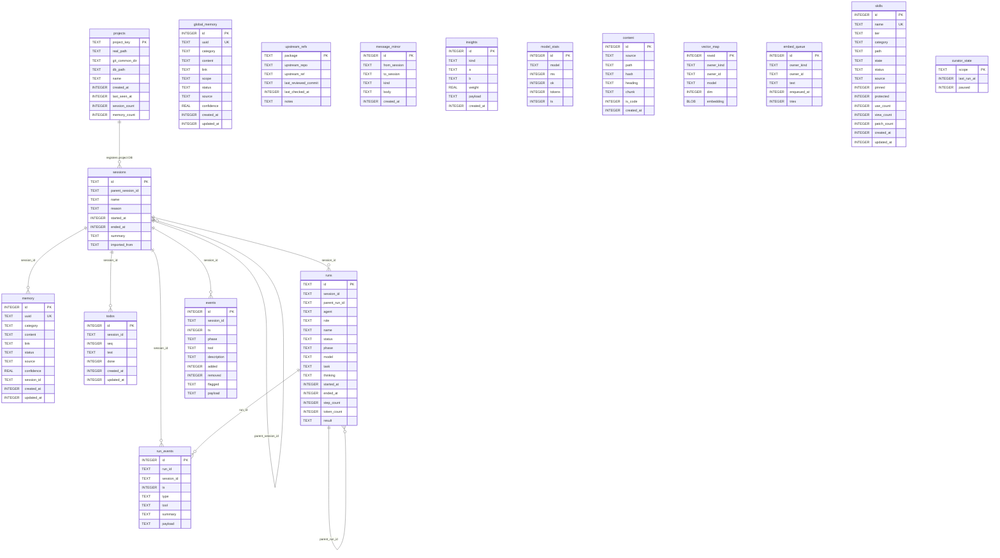

# Data model

Spider stores everything in SQLite. There are two kinds of database:

- A **global registry database** at `~/.pi/agent/spider/spider.db`. It tracks
  every project spider has seen and holds global-scope memory, skills bookkeeping
  shared across projects, and a few cross-session tables.
- A **per-project database** at `<project>/.spider/project.db`. It holds that one
  project's sessions, memory, todos, indexed content, runs, event log, and
  embedding state.

`@spider/db-core` owns both. It defines the schema, applies migrations, resolves
which file a project maps to, and provides the event helpers. Every other package
that reads or writes data opens a connection through `db-core` and works against
the `Db` handle it returns.

The schema is defined as two DDL strings in `packages/db-core/src/schema.ts`:
`GLOBAL_SCHEMA` for the registry database and `PROJECT_SCHEMA` for each
per-project database. Table and column names in those strings are canonical.

## Two databases, one process

A working session touches both databases. The global database answers "which
project am I in and where is its data" and stores memory scoped to `global`. The
per-project database stores the day-to-day records for the current project. The
`projects` table in the global database is the index: each row records a
project's key, its real path, and the absolute path of its `project.db` file.

Relationships inside the schema are by column convention, not declared foreign
keys. The DDL sets `foreign_keys = ON` at the connection level but does not add
`REFERENCES` clauses, so columns like `session_id`, `run_id`, and
`parent_run_id` link rows by value without database-enforced constraints.

## Entity relationship diagram

The diagram below shows the main tables across both databases. Tables above the
`projects`/`sessions` link live in the global registry database; the rest live in
the per-project database. The link from `projects` to `sessions` is logical: a
`projects` row names the file that contains those `sessions` rows, not a
row-level foreign key.

## Global registry database

`GLOBAL_SCHEMA` defines six tables.

| Table | Holds |
| --- | --- |
| `projects` | One row per project spider has resolved. Columns: `project_key` (primary key), `real_path`, `git_common_dir`, `db_path` (absolute path of the project's `project.db`), `name`, `created_at`, `last_seen_at`, and the counters `session_count` and `memory_count`. |
| `global_memory` | Memory scoped to `global`. Columns include `uuid` (unique), `category`, `content`, `link`, `scope` (default `global`), `status` (default `active`), `source` (default `user`), `confidence`, and timestamps. |
| `upstream_refs` | Tracking rows for vendored subsystems, keyed by `package`, with `upstream_repo`, `upstream_ref`, `last_reviewed_commit`, `last_checked_at`, and `notes`. |
| `message_mirror` | A cross-session message log: `from_session`, `to_session`, `kind`, `body`, `created_at`. |
| `insights` | Derived observations: `kind`, a pair of endpoints `a` and `b`, a `weight`, a JSON `payload`, and `created_at`. |
| `model_stats` | Per-call model timing and outcome rows: `model`, `ms`, `ok`, `tokens`, `ts`. |

## Per-project database

`PROJECT_SCHEMA` defines the working tables plus their FTS5 companions.

| Table | Holds |
| --- | --- |
| `sessions` | One row per pi session in this project: `id` (primary key), `parent_session_id`, `name`, `reason`, `started_at`, `ended_at`, `summary`, `imported_from`. |
| `memory` | Project-scoped structured memory: `uuid` (unique), `category`, `content`, `link`, `status` (default `active`), `source` (default `user`), `confidence`, `session_id`, and timestamps. |
| `content` | Indexed and fetched content chunks: `source`, `path`, `hash`, `heading`, `chunk` text, an `is_code` flag, and `created_at`. |
| `todos` | Durable todos: `session_id`, `seq`, `text`, a `done` flag, and timestamps. |
| `runs` | Subagent runs: `id` (primary key), `session_id`, `parent_run_id`, `agent`, `role`, `name`, `status`, `phase`, `model`, `task`, `thinking`, timing, `step_count`, `token_count`, and `result`. |
| `run_events` | The append-only run event stream: `run_id`, `session_id`, `ts`, `type`, `tool`, `summary`, and a JSON `payload`. |
| `events` | The routing and tracking event log: `session_id`, `ts`, `phase` (`before` or `after`), `tool`, `description`, `added`, `removed`, `flagged`, `payload`. |
| `vector_map` | Embedding storage: `owner_kind`, `owner_id`, `model`, `dim`, and an `embedding` BLOB (raw little-endian `float32[dim]`, used for brute-force cosine similarity and re-embedding from source). |
| `embed_queue` | Pending embedding work: `owner_kind`, `owner_id`, `text`, `enqueued_at`, and a `tries` counter. |
| `skills` | Skill bookkeeping: `name` (unique), `tier`, `category`, `path`, `state`, `status`, `source`, `pinned`, `protected`, use/view/patch counters, last-used/viewed/patched timestamps, `candidate_body`, `related`, and timestamps. An index `idx_skills_state` covers `(state, status)`. |
| `curator_state` | One row per `scope`: `last_run_at` and a `paused` flag. |

### Full-text search companions

Four FTS5 virtual tables mirror text columns for full-text search:

- `sessions_fts` over session `name`, `summary`, and `content`.
- `memory_fts` over memory `category`, `content`, and `link`.
- `content_fts` over content `source`, `heading`, and `chunk`.
- `todos_fts` over todo `text`, defined as an external-content table
  (`content=todos, content_rowid=id`) so it stays in sync with `todos`.

### Vector storage

Embeddings live in two places, and both are separate from the FTS tables.

- `vector_map` is a plain table with a BLOB column. It stores each embedding as
  raw little-endian `float32` values alongside the owning row's kind and id, the
  model that produced it, and the dimension. This form supports brute-force
  cosine similarity and lets spider re-embed from the source text.
- A `vec0` virtual table named `vectors` provides indexed vector search. It is
  not part of `PROJECT_SCHEMA`. `Db.loadVec()` creates it on demand with
  `CREATE VIRTUAL TABLE IF NOT EXISTS vectors USING vec0(embedding float[384])`,
  loading the `sqlite-vec` extension the first time it runs. Later calls on the
  same connection are no-ops.

## Migrations and user_version

The schema version is `SCHEMA_VERSION = 3`, defined in
`packages/db-core/src/migrate.ts`. Each database records its own version in the
SQLite `user_version` pragma.

`migrate(db, scope)` reads `user_version` and does nothing if it already equals
or exceeds `SCHEMA_VERSION`. Otherwise it runs one transaction:

- **Fresh database (`user_version` 0).** It applies the full DDL for the scope
  (`GLOBAL_SCHEMA` or `PROJECT_SCHEMA`). The full schema already includes every
  column, so a fresh database never needs the incremental steps.
- **Existing database (`user_version` between 1 and `SCHEMA_VERSION - 1`).** It
  walks each version from `current + 1` up to `SCHEMA_VERSION` and applies that
  version's incremental steps.

Incremental steps are defined only for project scope, in `PROJECT_MIGRATIONS`,
keyed by the version each step set brings the database to:

- Version 2 adds a `thinking` column to `runs`.
- Version 3 creates the `skills` table, its `idx_skills_state` index, and the
  `curator_state` table.

For global scope, the per-version step lookup returns an empty list, so an
existing global database has its `user_version` advanced with no DDL applied.
After the steps run, `migrate` sets `user_version` to `SCHEMA_VERSION`.

## The event bus

`packages/db-core/src/events.ts` provides two append helpers and an in-process
publish/subscribe bus.

- `appendRunEvent(db, e)` inserts one row into `run_events` and emits the same
  event on `bus`. A `RunEvent` carries `runId`, `sessionId`, `ts`, `type`,
  `tool`, `summary`, and an arbitrary `payload` that is JSON-serialized on write.
- `appendEvent(db, e)` inserts one row into `events` (the routing and tracking
  log) and emits a derived event on `bus`. The emitted `type` is `tool_intent`
  when `phase` is `before` and `tool_result` when `phase` is `after`.
- `bus.on(listener)` subscribes and returns an unsubscribe function.
  `bus.emit(event)` calls every listener. A listener that throws is caught so
  one bad listener does not stop the others.

Read helpers cover the tracking log: `listEvents(db, opts?)` returns rows
filtered by `tool` and/or `phase` with an optional `limit`, and
`eventCountsByTool(db)` returns per-tool counts.

The bus is per process and in memory. It is not persisted; the persistence is the
`run_events` and `events` tables themselves.

## Path resolution

`packages/db-core/src/paths.ts` computes the on-disk locations.

- The global root is `~/.pi/agent/spider`. The registry database is
  `spider.db` inside it, and cached models live under `models`.
- A project root is `<cwd>/.spider`. The project database is `project.db`
  inside it.
- `paths.scratch(scope, cwd?)` and `paths.logs(scope, cwd?)` return the
  `scratch` and `logs` subdirectories of the matching root. Project scope
  requires a `cwd`.

`packages/db-core/src/registry.ts` resolves which project a working directory
belongs to. `resolveProject(cwd)` takes the real path of `cwd`, then asks git for
`--git-common-dir`. If that succeeds, the git common directory is the
`project_key`, so multiple worktrees of one repository share a project. If git is
not available, the real path is the key. The project database path is
`<projectRoot(realPath)>/project.db`. `resolveProject` upserts the resulting row
into `projects` and returns a `ProjectInfo`.

Connections are opened through registry functions: `openGlobal()` for the
registry database, `openProject(projectKey)` after a registry lookup,
`openDbAt(absPath, scope?)` for an explicit path (scope inferred from the path
when omitted), and `openProjectByPath(realPath)` to open a project database
directly without a registry lookup. Each of these migrates the database before
returning it.

## Native module ABI

`db-core` depends on two native addons: `better-sqlite3` for SQL and `sqlite-vec`
for vector search. Native addons are compiled against a specific Node ABI, so
they must be built for the same Node version that runs pi. The monorepo pins
Node 24 (the root `package.json` `volta` field) for this reason. Under a
different Node major version, these modules can fail to load at `require` time,
which means neither the databases nor vector search open. Building or reinstalling
under Node 24 is what keeps the two addons loadable.

## See also

- [`../../packages/db-core/README.md`](../../packages/db-core/README.md), the
  package reference for the API described here.
- [`./README.md`](./README.md), the system architecture overview.
- [`./feedback-and-learning-loops.md`](./feedback-and-learning-loops.md), how
  memory, routing, and the organism loop use these tables.
