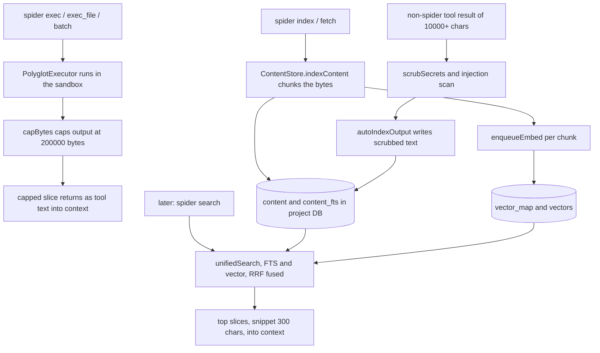
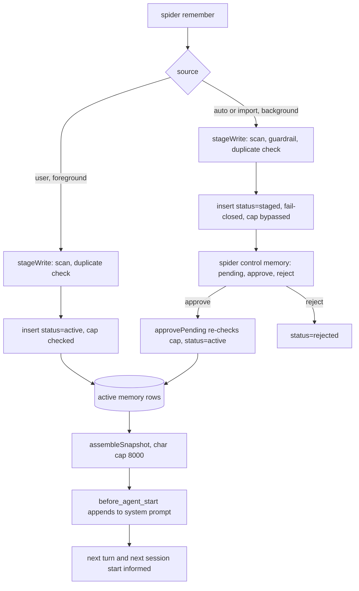
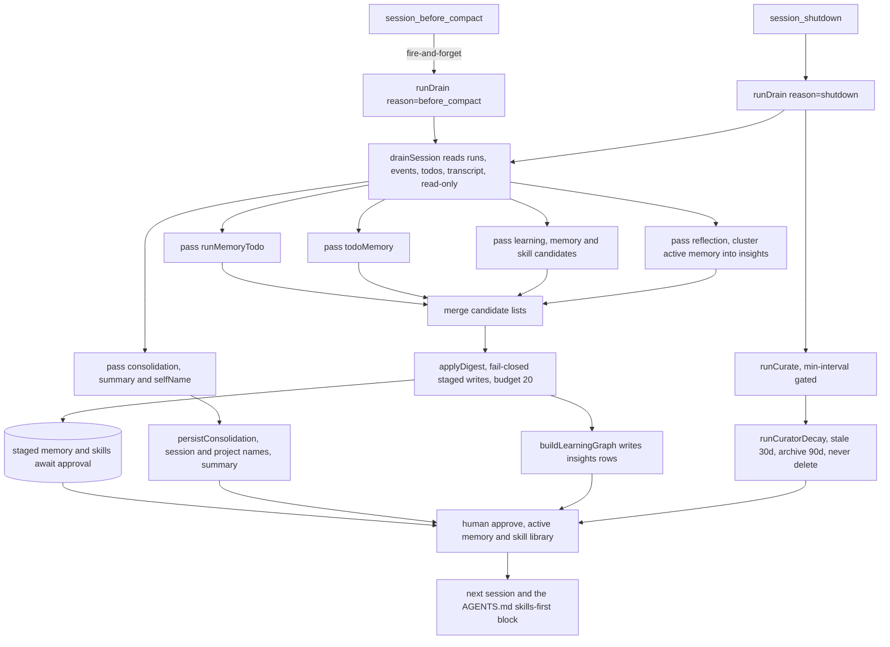
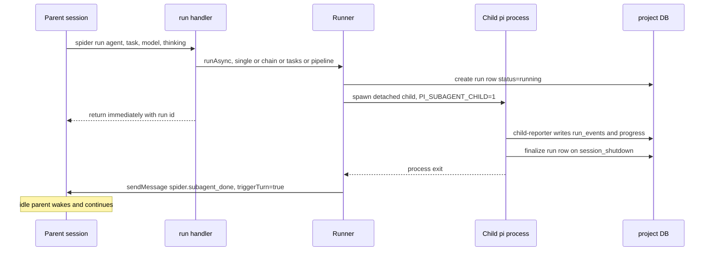
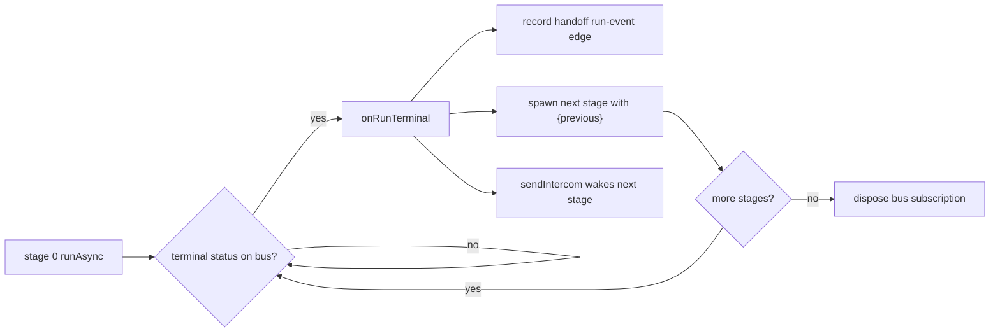

# Feedback and learning loops

Spider runs four loops on top of one shared SQLite database. Together they keep
the model context window small and carry knowledge from one session to the next.
Each loop is driven either by an explicit `spider` action or by a specific pi
lifecycle hook, so the triggers are predictable and the loops do not overlap by
accident.

The four loops are:

1. **The routing loop.** Large command output and large files go to the sandbox
   or the content index. The bytes stay in the database. Only the printed or
   queried slice enters the model context, and `spider search` retrieves the
   rest later.
2. **The memory lifecycle.** Foreground `remember` writes activate immediately.
   Background and auto-captured writes stage fail-closed and wait for approval.
   The active-memory snapshot is injected at `before_agent_start` and re-injected
   on every later turn and every new session.
3. **The organism feedback and learning loop.** On before-compact and on
   shutdown the organism drains the finished session, runs passes that propose
   memory and skill candidates, stages them, records a summary and a self-name,
   curates the skill library, and rebuilds the learning graph.
4. **The subagent loop.** `spider run` dispatches a child pi process, returns
   immediately, and reports completion through a `spider.subagent_done` message
   that wakes the parent. Pipelines chain a stage to the next stage over an
   intercom handoff.

## Trigger reference

| Trigger | Kind | What it drives |
| --- | --- | --- |
| `session_start` | pi hook | Insert a row into the project `sessions` table (memory hook). |
| `before_agent_start` | pi hook | Assemble the active-memory snapshot and append it to the system prompt. |
| `tool_call` / `tool_result` | pi hook | Record intent, scrub secrets, scan for injection, auto-index large non-spider output. |
| `session_before_compact` | pi hook | Fire-and-forget organism drain with `reason: "before_compact"`. |
| `session_shutdown` | pi hook | Await organism drain with `reason: "shutdown"`, then run curator decay. |
| `spider exec` / `exec_file` / `batch` | action | Run code in the sandbox; return a capped slice. |
| `spider index` / `fetch` | action | Chunk content into the `content` table and enqueue embeddings. |
| `spider search` | action | Fused full-text and vector retrieval over the database. |
| `spider remember` / `recall` | action | Write or read structured memory. |
| `spider run` | action | Dispatch a subagent (single, chain, parallel, or pipeline). |

---

## 1. The routing loop

The routing loop exists to keep the context window small. The default cost of a
large `git log`, a wide test run, or a 5,000-line file is that the whole output
lands in the model context and stays there for the rest of the conversation.
Spider routes those bytes into the database instead and returns only a bounded
slice.

Three paths write bytes to the database without pushing them all into context:

- **Sandboxed execution.** `spider exec`, `exec_file`, and `batch` run code
  through the `PolyglotExecutor` in the project working directory. The handler
  caps the returned text with `capBytes` at `MAX_EXEC_OUTPUT_BYTES` (200,000
  bytes). The full structured result is available as `details`, but only the
  capped stdout and stderr slice returns as the tool text that enters context.
- **Content indexing.** `spider index` and `spider fetch` pass content to
  `ContentStore.indexContent`, which splits it into chunks in the `content`
  table and mirrors them into `content_fts`. Each chunk is queued for embedding
  with `enqueueEmbed`. The action returns a one-line count, not the content.
- **Auto-indexing of tool output.** The host routing layer watches every
  non-`spider` tool result. When the scrubbed text is at least
  `autoIndexThreshold` (default 10,000) characters, `autoIndexOutput` writes it
  into `content`/`content_fts` under a `tool:<name>` source. The `spider` tool
  itself is exempt from this path, because its actions already route their own
  output.

On the same `tool_result` path, `processToolContent` runs `scrubSecrets` and a
prompt-injection scan before anything is indexed, so secrets never enter the
recall corpus. The `tool_call` path records intent through
`sanitizeIntentPayload`, which replaces content-bearing fields with size and
count metadata (a `content` string becomes `contentBytes`), so the `events` log
stores what ran and where, never the full bytes.

Retrieval closes the loop. `spider search` calls `unifiedSearch`, which runs
full-text queries across `memory`, `content`, `session`, and `todo`, adds vector
KNN results for `memory`, `content`, and `session` when an embedder is
available, fuses the lists with reciprocal-rank fusion, reranks by query
proximity, and returns each hit as a snippet capped at 300 characters. The agent
pulls back only the slices that match the current question.

---

## 2. The memory lifecycle

Memory holds structured, categorized notes at project or global scope. A record
has one of six categories (`preference`, `convention`, `tool-quirk`, `failure`,
`correction`, `insight`), content, an optional link, a status, and a source. The
lifecycle differs by how a write originates.

**Foreground writes activate immediately.** `spider remember` reaches
`makeRemember`, which calls `stageWrite` with `source: "user"` unless the caller
sets `auto`. `stageWrite` runs a fixed order: a strict threat scan, then (for
background writes only) the anti-poisoning guardrail, then a duplicate check,
then the staged-versus-active decision. A user write with no `autoStage` inserts
as `status: "active"` right away, subject to the per-scope character cap. If the
write would push the scope's active content over `DEFAULT_MEMORY_CHAR_CAP`
(8,000 characters), `assertWithinCap` throws `MemoryOverflowError` and no row is
written.

**Background and auto writes stage fail-closed.** Any write with
`source: "auto"`, `source: "import"`, or the `autoStage` option is always
inserted as `status: "staged"`, no matter what the caller asked for. The scan
still runs first, and the guardrail rejects background writes that describe
negative tool claims, transient errors, or environment-specific failures. A
staged insert bypasses the character cap by design, because nothing staged is
active yet. Staged rows do not appear in `listActive`, `recall`, or the
snapshot, all of which read `status = 'active'` only.

**Approval promotes a staged write.** A human reviews staged writes with
`spider control memory` (`pending`, `approve`, `reject`). `approvePending`
re-checks the cap at approval time, so an approval can still fail with
`MemoryOverflowError` if the scope filled up while the write was staged.
Rejection sets `status: "rejected"`. Nothing is hard-deleted; rejected and
archived rows stay in the table and are removed only from the FTS mirror.

**The active snapshot is injected at `before_agent_start`.** The
`makeBeforeAgentStart` hook calls `assembleSnapshot`, which reads the active
records for the requested scopes (global and project by default), sorts
user-authored records first and then by recency, groups them by category, and
stops once the running length would exceed the char cap (8,000 by default). The
hook appends the result to `event.systemPrompt` only when the snapshot is
non-empty and the system prompt is already a string. The snapshot is computed
fresh on each call. A memory approved mid-session does not change the prompt
already sent for the current turn: it takes effect starting with the next
`before_agent_start` call, which in practice means the next turn or the next
session. The `session_start` hook (`makeSessionStart`) inserts the session row
that the organism later drains.

---

## 3. The organism feedback and learning loop

The organism turns a finished session into durable knowledge. It never runs on
the foreground request path. `registerOrganism` attaches two lifecycle hooks and
builds one `OrganismWorker`.

**Triggers.** `session_before_compact` fires a fire-and-forget drain with
`reason: "before_compact"`: it never returns `false`, never calls a cancel API,
and swallows every error, so it cannot block or alter compaction.
`session_shutdown` awaits a drain with `reason: "shutdown"` and then runs
`runCurate`. The `OrganismWorker` serializes every entry point through a single
in-flight chain, so a before-compact drain and a shutdown drain (or a drain and
a curate) never run against the database at the same time. The master
`org.enabled` toggle short-circuits `runDrain` to a zeroed summary.

**Drain.** `drainSession` reads the session's `runs`, `run_events`, `events`,
and `todos`, its stored name, and, when a transcript path exists, the normalized
conversation, into a `DigestBundle`. It reads only; the event log is left
intact.

**Passes.** The worker runs a set of passes, each gated by its per-pass toggle
in `OrganismConfig.passes`. Model-dependent passes are skipped (treated as an
empty result) when no aux model is available, and each pass runs inside its own
try/catch so one throwing pass does not stop the drain:

- **runMemoryTodo**: summarize subagent run activity, ask the aux model for
  durable memory and follow-up todo candidates. Emits no skills.
- **todoMemory**: digest completed todos into durable memory candidates.
- **learning**: drive the aux model over the transcript with the combined
  review prompt and the "do not capture" block, emitting staged memory and
  staged skill candidates co-equally. Skill candidates with an empty body or a
  session-artifact name (a PR or issue number, a `fix-`/`debug-`/`audit-`
  prefix, or a `-today` suffix) are dropped.
- **consolidation**: produce a one to three sentence session summary and a short
  self-name slug for the ongoing task. Emits no candidates.
- **reflection**: cluster active project memory by vector proximity and ask the
  model to synthesize each dense cluster into one umbrella `insight`. Degrades
  to an empty result when no embedder is available.

Every memory candidate from these passes is filtered through `shouldCapture`,
which enforces the six-category taxonomy and the anti-poisoning rules.

**Staging versus curation.** These are two different mechanisms.

Staging is what `applyDigest` does to the merged candidate lists. It is
fail-closed: nothing becomes active memory or an active skill directly. A shared
`WriteBudget` (default `autoWriteBudget` of 20 per drain) is spent one unit per
memory stage and one unit per skill stage, in memory-then-skills order. Memory
goes through `stageWrite` with `source: "auto"` and `autoStage: true`; skills go
through `SkillStore.stageCandidate`. When the budget is exhausted, remaining
stageable candidates are dropped and counted, never silently discarded. Todos
are added directly and are not budget-limited.

Curation is what `runCurate` does to skills that already exist. On shutdown it
runs `runCuratorDecay`, gated by `curatorShouldRun` (paused state, or less than
`minIntervalHours` since the last run, blocks it) unless forced. The walk anchors
each skill's idle age on its most recent real activity and applies two cutoffs:
past `staleAfterDays` (default 30) a skill becomes `stale`; past
`archiveAfterDays` (default 90) it becomes `archived` and its directory is moved
into `.spider/skills/.archive/`. Pinned and protected skills are never
transitioned, a never-used skill is not archived before it is at least stale-age
old, and nothing is ever deleted. When `curator.consolidate` is on and a model
is available, `consolidateSkills` runs an umbrella-building pass that archives
absorbed or pruned agent-created skills.

**Self-naming.** After apply, `persistConsolidation` writes the self-name slug
to `sessions.name` and the summary to `sessions.summary`, keeps `sessions_fts`
in sync, and, only when `selfNaming` is on, sets `projects.name` if that name is
currently null or empty. It never clobbers a user-set project name. Every write
is guarded so a missing table or column cannot throw on the drain path.

**Learning graph and insights.** When the `insights` pass toggle is on, the
worker rebuilds the learning graph with `buildLearningGraph`. Nodes are the
non-archived skills and the active project memories. Edges are skill-to-skill
links from each skill's declared `related` list plus memory-to-skill links
scored by lexical token overlap (with a bonus when a skill name appears verbatim
in a memory), keeping the top four scoring skills per memory. The graph carries
a `linkedPct` statistic and is persisted as node and edge rows in an `insights`
table on the global database. `control insights` assembles the same graph
without persisting it.

**Feeding the next session and AGENTS.md.** Nothing the organism produces is
active until a human approves it. Once approved, it flows forward:

- Approved staged memory becomes active and is injected as part of the frozen
  snapshot at the next `before_agent_start` (loop 2).
- Approved staged skills become active in the skill library.
- The session summary and self-name are indexed into `sessions_fts`, so past
  sessions are searchable and the ongoing task keeps a stable name.
- The project name is set when it had none.
- The `@spider/superpowers` managed block in `AGENTS.md` tells the agent to load
  skills before acting, so the curated library shapes the next session's
  behavior.

---

## 4. The subagent loop

`spider run` dispatches work to a child pi process and returns before the child
finishes. The `run` handler routes by argument shape: `pipeline`, then `chain`,
then `tasks` (parallel), then a single run. Every mode runs async by design.

**Dispatch and background run.** For a single run, `Runner.runAsync` creates a
run row with `status: "running"`, spawns a detached child through
`buildChildSpawnSpec` (with `PI_SUBAGENT_CHILD=1`, the database path, the run
id, and the parent session id in the environment), and returns the run row
immediately. The handler stamps the parent's current model and thinking level on
runs that do not name one, and `qualifyModelProvider` resolves a bare model id
to a provider that the child can authenticate against.

**Reporting back.** Inside the child, `attachChildReporter` wires the child's pi
events (`tool_execution_start`, `tool_execution_end`, `message_end`,
`turn_start`, `agent_start`, `session_shutdown`) and writes `run_events` and
progress into the shared database, which the parent tails onto its live feed.
When the child process exits, `Runner.runAsync` finalizes the run row if the
child did not, then calls the async notifier exactly once. The notifier sends a
`spider.subagent_done` message with the curated output and `triggerTurn: true`.
That flag wakes an idle parent so the conversation continues automatically
instead of waiting for the user.

**Pipeline handoff.** For a `pipeline`, `PipelineCoordinator.start` spawns stage
0 async and subscribes to the run-events bus. When the current stage's run
reaches a terminal status (`done`, `failed`, or `cancelled`), `onRunTerminal`
spawns the next stage pre-wired with the prior result substituted for `{previous}`
and `{handoff}`, records a `handoff` run-event edge, and wakes the next stage
over intercom with `sendIntercom`. There is no blocking wait: the coordinator
advances stage by stage as each stage finishes, and disposes of its bus
subscription when the last stage completes.

---

## How the loops connect

The four loops share the project and global databases, so output from one
becomes input to another:

- The routing loop and the subagent loop both write `run_events` and `events`
  that the organism drain reads on before-compact and shutdown.
- The organism stages memory candidates through the same `stageWrite` pipeline
  the memory lifecycle uses; approving them feeds the snapshot injected at
  `before_agent_start`.
- The content the routing loop indexes and the summaries the organism writes are
  both retrievable through `spider search`, so a later session can find what an
  earlier one produced.

## See also

- [`./data-model.md`](./data-model.md): the tables, migrations, and the
  `run_events` bus these loops read and write.
- [`./README.md`](./README.md): the architecture overview and the full
  package interaction diagram.
- [`../../packages/organism/README.md`](../../packages/organism/README.md): the
  drain, passes, curator, and learning graph in detail.
- [`../../packages/memory/README.md`](../../packages/memory/README.md): the
  write pipeline, snapshot injection, and capture guardrails.
- [`../../packages/context/README.md`](../../packages/context/README.md): the
  sandbox, content store, and unified search behind the routing loop.
- [`../../packages/subagents/README.md`](../../packages/subagents/README.md):
  the runner, child reporter, and pipeline coordinator.
- [`../../packages/superpowers/README.md`](../../packages/superpowers/README.md):
  the skills library and the managed `AGENTS.md` block the learning loop feeds.
