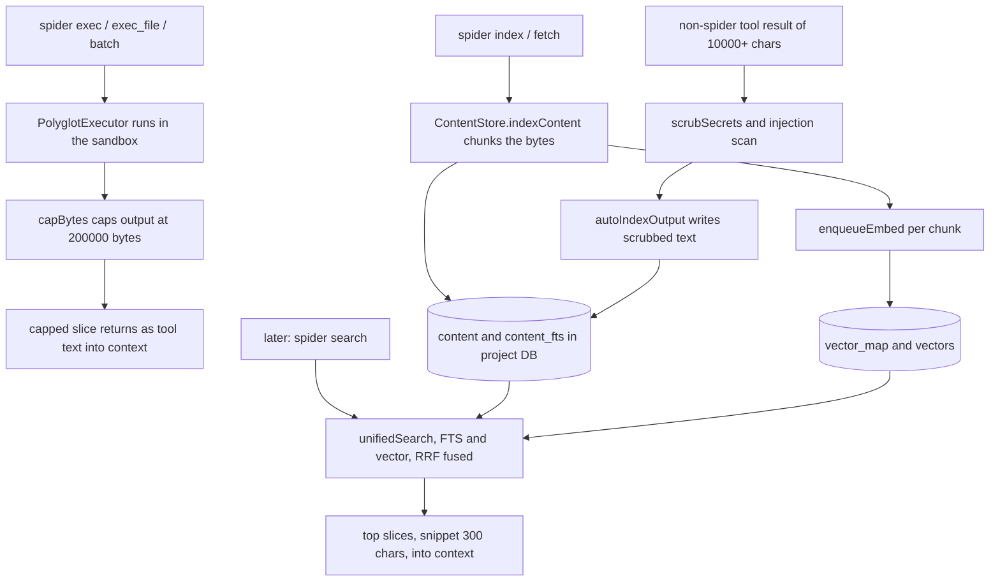
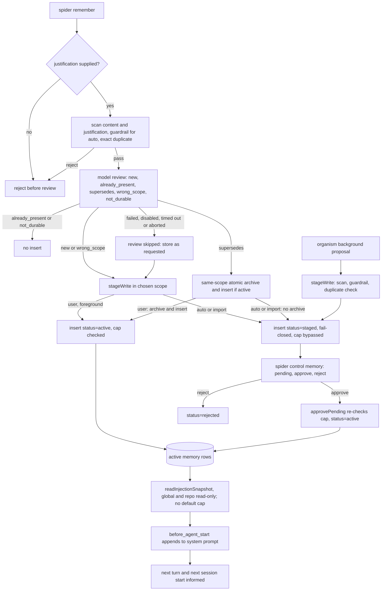
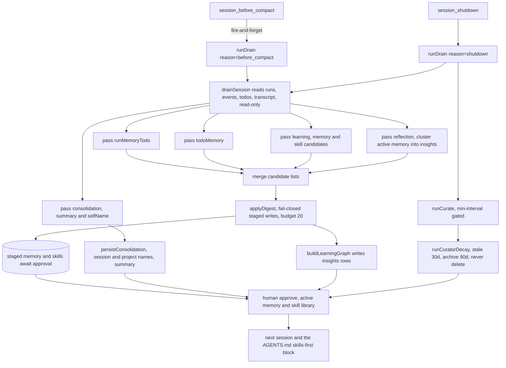
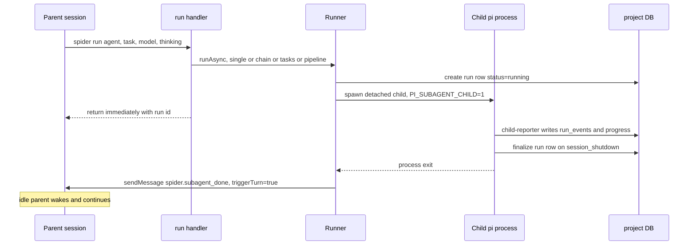
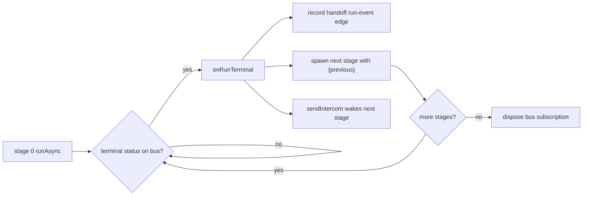

# Feedback and learning loops

Spider runs four loops on top of one shared SQLite database. Together they keep
the model context window small and carry knowledge from one session to the next.
Each loop is driven either by an explicit `spider` action or by a specific pi
lifecycle hook, so the triggers are predictable and the loops do not overlap by
accident.

The four loops are:

1. **The routing loop.** Large command output and large files go to the sandbox
   or the content index. The bytes stay in the database. Only the printed or
   queried slice enters the model context, and `spider search` retrieves the
   rest later.
2. **The memory lifecycle.** Foreground `remember` writes require justification and
   a durability, overlap, and scope review before activation. A failed review stores
   as requested. Auto-sourced and background writes stage fail-closed for approval.
   The active-memory snapshot is injected at `before_agent_start` and re-injected
   on every later turn and every new session.
3. **The organism feedback and learning loop.** On before-compact and on
   shutdown the organism drains the finished session, runs passes that propose
   memory and skill candidates, stages them, records a summary and a self-name,
   curates the skill library, and rebuilds the learning graph.
4. **The subagent loop.** `spider run` dispatches a child pi process, returns
   immediately, and reports completion through a `spider.subagent_done` message
   that wakes the parent. Pipelines chain a stage to the next stage over an
   intercom handoff.

## Trigger reference

| Trigger | Kind | What it drives |
| --- | --- | --- |
| `session_start` | pi hook | Insert a row into the project `sessions` table (host hook). |
| `before_agent_start` | pi hook | Assemble the active-memory snapshot and append it to the system prompt. |
| `tool_call` / `tool_result` | pi hook | Record intent, scrub secrets, scan for injection, auto-index large non-spider output. |
| `session_before_compact` | pi hook | Fire-and-forget organism drain with `reason: "before_compact"`. |
| `session_shutdown` | pi hook | Await organism drain with `reason: "shutdown"`, then run curator decay. |
| `spider exec` / `exec_file` / `batch` | action | Run code in the sandbox; return a capped slice. |
| `spider index` / `fetch` | action | Chunk content into the `content` table and enqueue embeddings. |
| `spider search` | action | Fused full-text and vector retrieval over the database. |
| `spider remember` / `recall` | action | Write or read structured memory. |
| `spider run` | action | Dispatch a subagent (single, chain, parallel, or pipeline). |

---

## 1. The routing loop

The routing loop exists to keep the context window small. The default cost of a
large `git log`, a wide test run, or a 5,000-line file is that the whole output
lands in the model context and stays there for the rest of the conversation.
Spider routes those bytes into the database instead and returns only a bounded
slice.

Three paths write bytes to the database without pushing them all into context:

- **Sandboxed execution.** `spider exec`, `exec_file`, and `batch` run code
  through the `PolyglotExecutor` in the project working directory. The handler
  caps the returned text with `capBytes` at `MAX_EXEC_OUTPUT_BYTES` (200,000
  bytes). The full structured result is available as `details`, but only the
  capped stdout and stderr slice returns as the tool text that enters context.
- **Content indexing.** `spider index` and `spider fetch` pass content to
  `ContentStore.indexContent`, which splits it into chunks in the `content`
  table and mirrors them into `content_fts`. Each chunk is queued for embedding
  with `enqueueEmbed`. The action returns a one-line count, not the content.
- **Auto-indexing of tool output.** The host routing layer watches every
  non-`spider` tool result. When the scrubbed text is at least
  `autoIndexThreshold` (default 10,000) characters, `autoIndexOutput` writes it
  into `content`/`content_fts` under a `tool:<name>` source. The `spider` tool
  itself is exempt from this path, because its actions already route their own
  output.

On the same `tool_result` path, `processToolContent` runs `scrubSecrets` and a
prompt-injection scan before anything is indexed, so secrets never enter the
recall corpus. The `tool_call` path records intent through
`sanitizeIntentPayload`, which replaces content-bearing fields with size and
count metadata (a `content` string becomes `contentBytes`), so the `events` log
stores what ran and where, never the full bytes.

Retrieval closes the loop. `spider search` calls `unifiedSearch`, which runs
full-text queries across `memory`, `content`, `session`, and `todo`, adds vector
KNN results for `memory`, `content`, and `session` when an embedder is
available, fuses the lists with reciprocal-rank fusion, reranks by query
proximity, and returns each hit as a snippet capped at 300 characters. The agent
pulls back only the slices that match the current question.

```mermaid
flowchart TD
  A["spider exec / exec_file / batch"] --> S["PolyglotExecutor runs in the sandbox"]
  S --> CAP["capBytes caps output at 200000 bytes"]
  CAP --> CTX1["capped slice returns as tool text into context"]

  B["spider index / fetch"] --> CS["ContentStore.indexContent chunks the bytes"]
  CS --> DBC[("content and content_fts in project DB")]
  CS --> EQ["enqueueEmbed per chunk"]
  EQ --> VM[("vector_map and vectors")]

  T["non-spider tool result of 10000+ chars"] --> SCRUB["scrubSecrets and injection scan"]
  SCRUB --> AI["autoIndexOutput writes scrubbed text"]
  AI --> DBC

  Q["later: spider search"] --> US["unifiedSearch, FTS and vector, RRF fused"]
  DBC --> US
  VM --> US
  US --> CTX2["top slices, snippet 300 chars, into context"]
```

---

## 2. The memory lifecycle

Memory holds structured, categorized notes at repo or global scope. A record
has one of six categories (`preference`, `convention`, `tool-quirk`, `failure`,
`correction`, `insight`), content, an optional link, a status, and a source. The
lifecycle differs by how a write originates.

**Foreground writes are reviewed before insertion.** `spider remember` requires
`justification` explaining durability after the task, usefulness to other agents,
and the requested scope. The host `remember` action injects an authenticated
`@spider/models` `complete()` reviewer into `reviewedWrite` in the memory package.
The deterministic justification, strict threat scan, background-only guardrail,
and exact duplicate checks run before any model call. The reviewer sees the
candidate and relevant active entries from both scopes (repo via sanitized FTS;
global via sanitized token matching because its table has no FTS). Its verdict
can insert as requested (`new`), reuse an active UUID (`already_present`), atomically
insert and archive active entries in the same scope via the FTS-aware path
(`supersedes`), insert
under a corrected scope (`wrong_scope`), or leave task-only facts in the
conversation without insertion (`not_durable`). An invalid verdict, timeout,
abort, unavailable model or disabled reviewer stores as requested and reports
`review skipped` with the reason. A supersedes verdict for an auto-sourced write
stages the new entry and reports pending supersessions without archiving anything;
entries in the other scope are related but never archived. Justification is stored on inserted
memory rows, including staged writes and wrong-scope redirects; verdicts that insert nothing
store no justification.

`stageWrite` remains the synchronous insert path used by background callers;
reviewed writes use it after validation. A user write with no `autoStage` inserts
as `status: "active"`, subject to the per-scope character cap. If the write
would push the scope's active content over `DEFAULT_MEMORY_CHAR_CAP` (8,000
characters), `assertWithinCap` throws `MemoryOverflowError` and no row is
written.

**Background and auto writes stage fail-closed.** Any write with
`source: "auto"`, `source: "import"`, or the `autoStage` option is always
inserted as `status: "staged"`, no matter what the caller asked for. The scan
still runs first, and the guardrail rejects background writes that describe
negative tool claims, transient errors, or environment-specific failures. A
staged insert bypasses the character cap by design, because nothing staged is
active yet. Staged rows do not appear in `listActive`, `recall`, or the
snapshot, all of which read `status = 'active'` only.

**Approval promotes a staged write.** A human reviews staged writes with
`spider control memory` (`pending`, `approve`, `reject`). `approvePending`
re-checks the cap at approval time, so an approval can still fail with
`MemoryOverflowError` if the scope filled up while the write was staged.
Rejection sets `status: "rejected"`. Nothing is hard-deleted; rejected and
archived rows stay in the table and are removed only from the FTS mirror.

**The active snapshot is injected at `before_agent_start`.** The host hook and
`control doctor` use one `readInjectionSnapshot` function. It resolves session
bindings from the read-only global DB, then reads active memory from the global and repo
tiers independently using read-only DB opens. It does not register projects,
migrate schemas, or write memory. A broken tier cannot hide the other tier's
entries; doctor reports the failing tier as unreadable. Snapshot assembly orders
preference and correction directives before observations, then groups by tier
and category within each priority band. There is no default snapshot cap: all
active entries are injected. An optional explicit `memory.snapshotCharCap`
limit skips entries that do not fit and continues packing smaller entries. It
appends `Memory snapshot: N entries omitted.` when a configured cap omits rows;
doctor reports this as a warning without failing its check. The hook returns a
system-prompt patch only when the snapshot is non-empty and the system prompt
is a string. The snapshot is computed fresh on each call. A memory approved
mid-session takes effect at the next `before_agent_start` call, usually the next
turn or session. The host `session_start` hook inserts the session row that the
organism later drains.

```mermaid
flowchart TD
  R["spider remember"] --> J{"justification supplied?"}
  J -->|no| NO["reject before review"]
  J -->|yes| PRE["scan content and justification, guardrail for auto, exact duplicate"]
  PRE -->|reject| NO
  PRE -->|pass| REVIEW["model review: new, already_present, supersedes, wrong_scope, not_durable"]
  REVIEW -->|"already_present or not_durable"| NOINSERT["no insert"]
  REVIEW -->|"failed, disabled, timed out or aborted"| SKIP["review skipped: store as requested"]
  REVIEW -->|"new or wrong_scope"| SW["stageWrite in chosen scope"]
  REVIEW -->|"supersedes"| ATOMIC["same-scope atomic archive and insert if active"]
  SKIP --> SW
  SW -->|"user, foreground"| ACT["insert status=active, cap checked"]
  SW -->|"auto or import"| STG["insert status=staged, fail-closed, cap bypassed"]
  ATOMIC -->|"user: archive and insert"| ACT
  ATOMIC -->|"auto or import: no archive"| STG
  ORG["organism background proposal"] --> BG["stageWrite: scan, guardrail, duplicate check"]
  BG --> STG

  STG --> REV["spider control memory: pending, approve, reject"]
  REV -->|approve| ACT2["approvePending re-checks cap, status=active"]
  REV -->|reject| REJ["status=rejected"]

  ACT --> AM[("active memory rows")]
  ACT2 --> AM

  AM --> SNAP["readInjectionSnapshot, global and repo read-only; no default cap"]
  SNAP --> INJ["before_agent_start appends to system prompt"]
  INJ --> NEXT["next turn and next session start informed"]
```

---

## 3. The organism feedback and learning loop

The organism turns a finished session into durable knowledge. It never runs on
the foreground request path. `registerOrganism` attaches two lifecycle hooks and
builds one `OrganismWorker`. The host skips registration when
`PI_SUBAGENT_CHILD=1`; manual organism actions and worker execution refuse in
children before model calls or drain receipts. Children can still use
`skill list`, `view`, and `add` directly against the repo DB without a worker
or model; `distill`, `approve`, and `reject` refuse.

Background completions use `github-copilot/gpt-6-luna` with `low` thinking by
default, never the session model. Explicit `auxiliary.background_review.model`
and `.provider` settings override the default. A provider-only override selects
`<provider>/gpt-6-luna`. A bare model id must match exactly one available catalog
entry, under the configured provider if supplied, without using the session
provider. If the selected model is unavailable, the drain records a model error
and fails without a fallback.

**Triggers.** `session_before_compact` fires a fire-and-forget drain with
`reason: "before_compact"`: it never returns `false`, never calls a cancel API,
and swallows every error, so it cannot block or alter compaction.
`session_shutdown` awaits a drain with `reason: "shutdown"` and then runs
`runCurate`. The `OrganismWorker` serializes every entry point through a single
in-flight chain, so a before-compact drain and a shutdown drain (or a drain and
a curate) never run against the database at the same time. The master
`org.enabled` toggle short-circuits `runDrain` to a zeroed summary.

**Drain.** `drainSession` reads the session's `runs`, `run_events`, `events`,
and `todos`, its stored name, and, when a transcript path exists, the normalized
conversation, into a `DigestBundle`. It reads only; the event log is left
intact.

**Passes.** The worker runs a set of passes, each gated by its per-pass toggle
in `OrganismConfig.passes`. Model resolution errors fail the drain with a
recorded error. Each pass runs inside its own try/catch so one throwing pass
does not stop the remaining passes; its error remains in the drain report:

- **runMemoryTodo**: summarize subagent run activity, ask the aux model for
  durable memory and follow-up todo candidates. Emits no skills.
- **todoMemory**: digest completed todos into durable memory candidates.
- **learning**: drive the aux model over the transcript with the combined
  review prompt and the "do not capture" block, emitting staged memory and
  staged skill candidates co-equally, with zero proposals as the default.
  Typed skill names and bodies are preserved verbatim for counted deterministic
  validation and durability review at apply. The learner does not patch existing skills.
- **consolidation**: produce a one to three sentence session summary and a short
  self-name slug for the ongoing task. Emits no candidates.
- **reflection**: cluster active repo memory by vector proximity and ask the
  model to synthesize each dense cluster into one umbrella `insight`. Degrades
  to an empty result when no embedder is available.

Every memory candidate from these passes is filtered through `shouldCapture`,
which enforces the six-category taxonomy and the anti-poisoning rules.

**Staging versus curation.** These are two different mechanisms.

Staging is what `applyDigest` does to the merged candidates. Nothing becomes
active directly. A shared `WriteBudget` (default 20 per drain) is spent one unit
per memory stage and one unit per accepted skill queue insert, memory first.
Skills pass deterministic checks and `organism.maxSkillProposals` (default 1)
before entering the repo `skill_review_queue`. The drain never calls the skill
reviewer; its receipt counts `skillsQueued`. Only a live top-level session starts
the asynchronous runner, at session start and after a before-compact drain.
Shutdown cancels existing reviewers before closing DBs, never starting new ones.
Children cannot run the queue; explicit child `skill op=add` uses inline review.

A repo DB lease allows only one queued review at a time, across handles and
processes. The review uses its own timeout (180000 ms by default, configurable
1000-600000) and thinking (`xhigh` by default). Both reviewers accept the shared
`off`, `minimal`, `low`, `medium`, `high`, `xhigh`, `max` levels. The authenticated
pi `streamSimple(...).result()` path maps provider-neutral reasoning. Per-model
capabilities follow pi's upward-first hole filling, then downward fallback;
non-reasoning models use off. Requested/effective levels and plain cap or
adjustment notices are recorded in `.spider/logs/reviewer-thinking.jsonl`.
Only `new` stages with review_reason.
Other verdicts are removed and recorded in the bounded recent-results table.
Reviewer failures keep the candidate with attempts++ and last_error; the third
failure drops it with a recorded reason. Doctor shows queue length and recent
verdicts. Unavailable rubric/catalog omits learner skill guidance without losing
memory proposals; disabled skill review also omits it. Raw failures are restricted
to the local diagnostics log, rotated at 1 MiB with a 2 KiB raw-reply limit.

Both reviewer catalogs and learner guidance are bounded: 150 skills ordered
bundled, active, pi-loaded, newest staged; 300-character descriptions; a total
learner system prompt ceiling of 180000 UTF-8 bytes including the full runtime
rubric. Oversized guidance is omitted while memory learning continues. The
reviewer judges structure, discovery triggers, token efficiency and anti-patterns,
not deployment evidence. Agent-origin skills allow 1500 words/16 KB; learner and
curator validation retains 500 words/8000 bytes. Frontmatter is exactly name and
a Use when description for all origins. Todos are not budget-limited.

Curation is what `runCurate` does to skills that already exist. On shutdown it
runs `runCuratorDecay`, gated by `curatorShouldRun` (paused state, or less than
`minIntervalHours` since the last run, blocks it) unless forced. The walk anchors
each skill's idle age on its most recent real activity and applies two cutoffs:
past `staleAfterDays` (default 30) a skill becomes `stale`; past
`archiveAfterDays` (default 90) it becomes `archived` and its directory is moved
into `.spider/skills/.archive/`. Pinned and protected skills are never
transitioned, a never-used skill is not archived before it is at least stale-age
old, and nothing is ever deleted. When `curator.consolidate` is on and a model
is available, `consolidateSkills` runs an umbrella-building pass that archives
absorbed or pruned agent-created skills. It only archives existing skills and
never stages candidates; unsolicited `skills` reply fields are ignored.

**Self-naming.** After apply, `persistConsolidation` writes the self-name slug
to `sessions.name` and the summary to `sessions.summary`, keeps `sessions_fts`
in sync, and, only when `selfNaming` is on, sets `projects.name` if that name is
currently null or empty. It never clobbers a user-set project name. Every write
is guarded so a missing table or column cannot throw on the drain path.

**Learning graph and insights.** When the `insights` pass toggle is on, the
worker rebuilds the learning graph with `buildLearningGraph`. Nodes are the
non-archived skills and the active repo memories. Edges are skill-to-skill
links from each skill's declared `related` list plus memory-to-skill links
scored by lexical token overlap (with a bonus when a skill name appears verbatim
in a memory), keeping the top four scoring skills per memory. The graph carries
a `linkedPct` statistic and is persisted as node and edge rows in an `insights`
table on the global database. `control insights` assembles the same graph
without persisting it.

**Feeding the next session and AGENTS.md.** Nothing the organism produces is
active until a human approves it. Once approved, it flows forward:

- Approved staged memory becomes active and is injected as part of the frozen
  snapshot at the next `before_agent_start` (loop 2).
- Approved staged skills become active in the skill library.
- The session summary and self-name are indexed into `sessions_fts`, so past
  sessions are searchable and the ongoing task keeps a stable name.
- The project name is set when it had none.
- The `@spider/superpowers` managed block in `AGENTS.md` tells the agent to load
  skills before acting, so the curated library shapes the next session's
  behavior.

```mermaid
flowchart TD
  BC["session_before_compact"] -->|fire-and-forget| RD["runDrain reason=before_compact"]
  SH["session_shutdown"] --> RD2["runDrain reason=shutdown"]
  RD2 --> CU["runCurate, min-interval gated"]

  RD --> DR["drainSession reads runs, events, todos, transcript, read-only"]
  RD2 --> DR

  DR --> P1["pass runMemoryTodo"]
  DR --> P2["pass todoMemory"]
  DR --> P3["pass learning, memory and skill candidates"]
  DR --> P4["pass consolidation, summary and selfName"]
  DR --> P5["pass reflection, cluster active memory into insights"]

  P1 --> MG["merge candidate lists"]
  P2 --> MG
  P3 --> MG
  P5 --> MG
  MG --> AP["applyDigest, fail-closed staged writes, budget 20"]
  P4 --> PC["persistConsolidation, session and project names, summary"]

  AP --> STG[("staged memory and skills await approval")]
  AP --> LG["buildLearningGraph writes insights rows"]
  CU --> DECAY["runCuratorDecay, stale 30d, archive 90d, never delete"]

  STG --> FEED["human approve, active memory and skill library"]
  PC --> FEED
  LG --> FEED
  DECAY --> FEED
  FEED --> NS["next session and the AGENTS.md skills-first block"]
```

---

## 4. The subagent loop

`spider run` dispatches work to a child pi process and returns before the child
finishes. The `run` handler routes by argument shape: `pipeline`, then `chain`,
then `tasks` (parallel), then a single run. Every mode runs async by design.

**Dispatch and background run.** For a single run, `Runner.runAsync` creates a
run row with `status: "running"`, spawns a detached child through
`buildChildSpawnSpec` (with `PI_SUBAGENT_CHILD=1`, the database path, the run
id, and the parent session id in the environment), and returns the run row
immediately. The handler stamps the parent's current model and thinking level on
runs that do not name one, and `qualifyModelProvider` resolves a bare model id
to a provider that the child can authenticate against.

**Reporting back.** Inside the child, `attachChildReporter` wires the child's pi
events (`tool_execution_start`, `tool_execution_end`, `message_end`,
`turn_start`, `agent_start`, `session_shutdown`) and writes `run_events` and
progress into the shared database, which the parent tails onto its live feed.
When the child process exits, `Runner.runAsync` finalizes the run row if the
child did not, then calls the async notifier exactly once. The notifier sends a
`spider.subagent_done` message with the curated output and `triggerTurn: true`.
That flag wakes an idle parent so the conversation continues automatically
instead of waiting for the user.

```mermaid
sequenceDiagram
  participant P as Parent session
  participant H as run handler
  participant R as Runner
  participant C as Child pi process
  participant DB as project DB

  P->>H: spider run agent, task, model, thinking
  H->>R: runAsync, single or chain or tasks or pipeline
  R->>DB: create run row status=running
  R->>C: spawn detached child, PI_SUBAGENT_CHILD=1
  H-->>P: return immediately with run id
  C->>DB: child-reporter writes run_events and progress
  C->>DB: finalize run row on session_shutdown
  C-->>R: process exit
  R->>P: sendMessage spider.subagent_done, triggerTurn=true
  Note over P: idle parent wakes and continues
```

**Pipeline handoff.** For a `pipeline`, `PipelineCoordinator.start` spawns stage
0 async and subscribes to the run-events bus. When the current stage's run
reaches a terminal status (`done`, `failed`, or `cancelled`), `onRunTerminal`
spawns the next stage pre-wired with the prior result substituted for `{previous}`
and `{handoff}`, records a `handoff` run-event edge, and wakes the next stage
over intercom with `sendIntercom`. There is no blocking wait: the coordinator
advances stage by stage as each stage finishes, and disposes of its bus
subscription when the last stage completes.

```mermaid
flowchart LR
  S0["stage 0 runAsync"] --> B{"terminal status on bus?"}
  B -->|no| B
  B -->|yes| ON["onRunTerminal"]
  ON --> HE["record handoff run-event edge"]
  ON --> S1["spawn next stage with {previous}"]
  ON --> IC["sendIntercom wakes next stage"]
  S1 --> B2{"more stages?"}
  B2 -->|yes| B
  B2 -->|no| D["dispose bus subscription"]
```

---

## How the loops connect

The four loops share the project and global databases, so output from one
becomes input to another:

- The routing loop and the subagent loop both write `run_events` and `events`
  that the organism drain reads on before-compact and shutdown.
- The organism stages memory candidates through the same `stageWrite` pipeline
  the memory lifecycle uses; approving them feeds the snapshot injected at
  `before_agent_start`.
- The content the routing loop indexes and the summaries the organism writes are
  both retrievable through `spider search`, so a later session can find what an
  earlier one produced.

## See also

- [`./data-model.md`](./data-model.md): the tables, migrations, and the
  `run_events` bus these loops read and write.
- [`./README.md`](./README.md): the architecture overview and the full
  package interaction diagram.
- [`../../packages/organism/README.md`](../../packages/organism/README.md): the
  drain, passes, curator, and learning graph in detail.
- [`../../packages/memory/README.md`](../../packages/memory/README.md): the
  write pipeline, snapshot injection, and capture guardrails.
- [`../../packages/context/README.md`](../../packages/context/README.md): the
  sandbox, content store, and unified search behind the routing loop.
- [`../../packages/subagents/README.md`](../../packages/subagents/README.md):
  the runner, child reporter, and pipeline coordinator.
- [`../../packages/superpowers/README.md`](../../packages/superpowers/README.md):
  the skills library and the managed `AGENTS.md` block the learning loop feeds.
