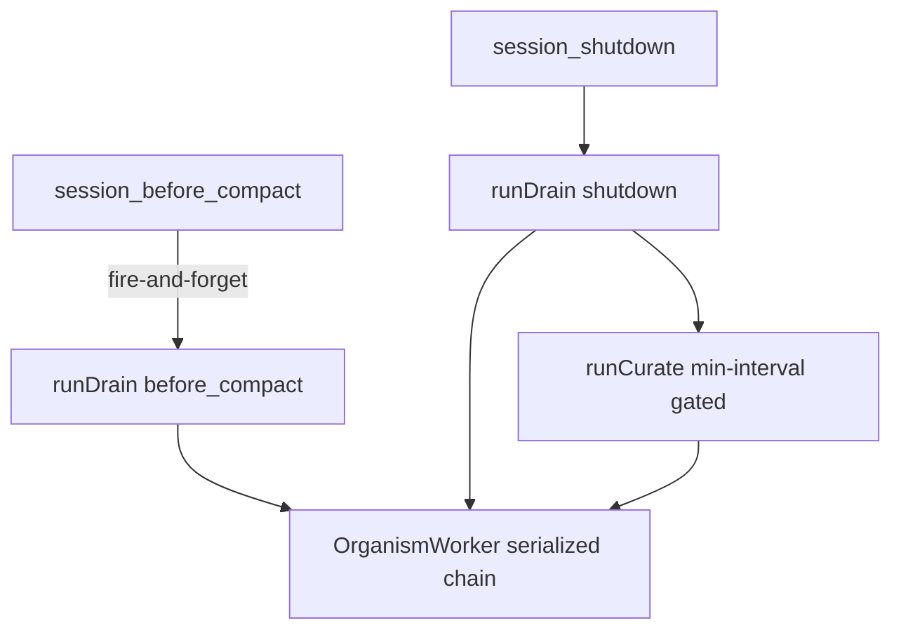
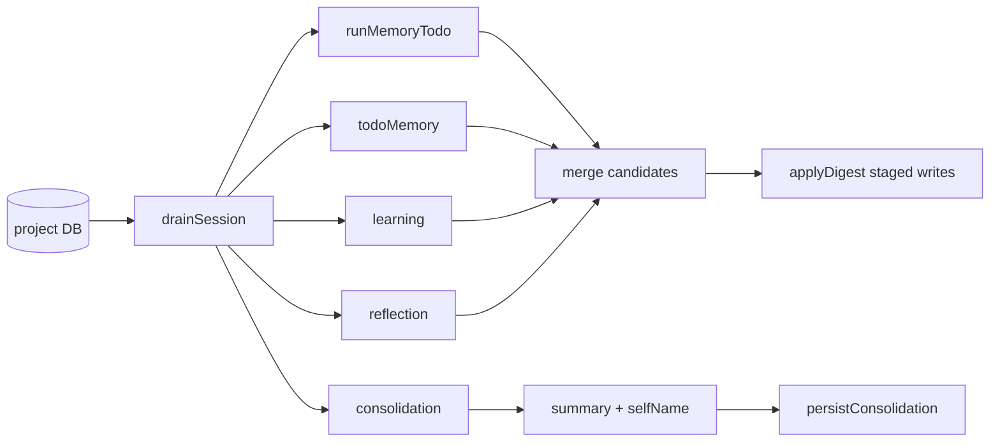

# @spider/organism

The autonomic feedback and learning loop. When a session compacts or shuts
down, the organism reads that session's activity, runs a set of passes that
propose durable memory and candidate skills, stages them for approval,
records a summary and a self-chosen name, curates the skill library, and
rebuilds the learning graph so the next session starts better informed.

## Responsibility

This package owns the background work that turns a finished session into
durable knowledge:

- **Drain.** Read a session's runs, events, todos, and transcript out of the
  project DB into a `DigestBundle`. Read-only; nothing in the event log is
  modified or removed.
- **Passes.** Run one or more digest passes over the bundle. Each pass asks an
  auxiliary model (or uses vectors, in the reflection pass) for candidate
  memory, todos, or skills.
- **Apply.** Route every candidate through a fail-closed staged writer under a
  per-drain write budget.
- **Consolidation and self-naming.** Persist a short session summary and a
  short self-name slug for the ongoing task, and name the project when it has
  no user-set name.
- **Curator.** On shutdown, walk the skill library and move idle skills toward
  stale and then to a recoverable archive. Optionally run an aux-model
  consolidation pass.
- **Learning graph and insights.** Assemble a graph of skills and active
  memory with the edges between them, and optionally persist it as `insights`
  rows for later display.

It deliberately does **not** approve its own writes. Every memory and skill it
produces is staged and waits for a human to approve or reject it. It does not
delete skills; the most destructive action it takes is archiving. It does not
cancel or alter compaction. It does not author skills itself in the digest
passes; the `/learn` path hands the live agent a prompt and lets the agent
author the `SKILL.md`.

## Key modules

| File | What it does |
| --- | --- |
| `index.ts` | Public exports and `registerOrganism`, which wires the worker onto the pi host lifecycle hooks. |
| `worker.ts` | `OrganismWorker`: the single in-process worker that owns the drain → passes → apply → persist pipeline and the curator pass. Serializes all entry points so two runs never race the DB. |
| `drain.ts` | `drainSession`: read a session's runs, run events, tracked events, todos, and transcript into a `DigestBundle`. Reads only. |
| `apply.ts` | `applyDigest`: fail-closed staged writer that spends a shared `WriteBudget` on memory and skill stages and counts drops and rejections. |
| `passes/run-memory-todo.ts` | Pass 1: subagent run activity to memory and follow-up todo candidates. |
| `passes/todo-memory.ts` | Pass 2: completed todos to durable memory candidates. |
| `passes/learning.ts` | Pass 3: transcript to co-equal staged memory and skill candidates, with the "do not capture" guardrails and the class-level skill-name rule. |
| `passes/consolidation.ts` | Pass 4: transcript and runs to a session summary and a self-name slug. Emits no candidates. |
| `passes/reflection.ts` | Pass 5: cluster active memory by vector proximity and synthesize each dense cluster into one umbrella insight. |
| `curator.ts` | Deterministic decay walk (stale/archive by idle age), the min-interval gate, file archiving, and the opt-in aux-model consolidation prompt. |
| `learn.ts` | `buildLearnPrompt` and `AUTHORING_STANDARDS` for the `/learn` skill-authoring handoff. |
| `learning-graph.ts` | `buildLearningGraph`: assemble skill and memory nodes with skill-to-skill and memory-to-skill edges, and optionally persist as `insights`. |
| `aux-model.ts` | `createDigestModel` and `parseCandidates`: build a `DigestModel` from context and tolerantly parse an aux-model reply into typed candidates. |
| `skill-usage.ts` | `SkillStore`: lifecycle state, use/view/patch counters, pin/protect flags, and the staged-candidate flow over the `skills` table. |
| `actions.ts` | `skillAction`, `curateAction`, `insightsAction`: the handlers behind the `skill`, `control skill curate`, and `control insights` surfaces. |
| `config.ts` | `OrganismConfig` and `CuratorConfig` with defaults and guarded deep-merge readers. |
| `types.ts` | Shared types: `DigestBundle`, `DigestResult`, `DigestModel`, `WriteBudget`, `AppliedSummary`, `PassName`, `DrainReason`. |
| `renderers.ts` | Themed panels for skill list/view, distill, curate result, and insights. |

## Public surface

From `index.ts`:

- `registerOrganism(host, pi, deps)`: build one `OrganismWorker` and register
  the two lifecycle hooks (`session_before_compact`, `session_shutdown`).
- `drainSession(db, sessionId, reason, opts)` / `DrainOpts`: read a session
  into a `DigestBundle`.
- `OrganismWorker` / `WorkerDeps`: the serialized worker with `runDrain` and
  `runCurate`.
- `runCuratorDecay`, `curatorShouldRun`, `consolidateSkills`,
  `archiveSkillFiles`, `CURATOR_DEFAULTS`, `CuratorConfig`, `DecayResult`: the
  curator.
- `buildLearnPrompt`, `AUTHORING_STANDARDS`: the `/learn` handoff.
- `buildLearningGraph`, `tokenize`, `GraphNode`, `GraphEdge`, `LearningGraph`:
  the learning graph.
- `createDigestModel`, `parseCandidates`, `AuxCall`: the aux-model seam.
- `SkillStore`, `SkillRow`, `SkillState`, `SkillStatus`: the skill store.
- `skillAction`, `curateAction`, `insightsAction` and their arg/result types:
  the action handlers.
- `renderSkillList`, `renderSkillView`, `renderDistill`, `renderCurateResult`,
  `renderInsights`: the renderers.
- `ORGANISM_DEFAULTS`, `readOrganismConfig`, `readCuratorConfig`,
  `OrganismConfig`: configuration.
- `AppliedSummary`, `DigestBundle`, `DigestModel`, `DigestResult`,
  `DrainReason`, `PassName`, `WriteBudget`, `emptyResult`: shared types.

## How the loop runs

### Triggers: before-compact and shutdown

`registerOrganism` attaches two hooks. `pi.on` chains, so they coexist with any
other handlers.

- `session_before_compact` fires a best-effort drain with
  `reason: "before_compact"`. It is fire-and-forget: compaction proceeds
  regardless. The handler never returns `false`, never calls a cancel API, and
  swallows every error, so it cannot block or alter compaction.
- `session_shutdown` awaits a drain with `reason: "shutdown"`, then runs a
  curator pass gated by the min-interval. Errors are swallowed so shutdown is
  never broken.

The `OrganismWorker` serializes every entry point through a single in-flight
chain. A second call while one is running is queued and awaits the prior one,
so a before-compact drain and a shutdown drain (or a drain and a curate) never
run against the DB at the same time.

### Drain

`drainSession` reads the session's `runs`, `run_events`, `events`, and `todos`
from the project DB, the session's stored name, and, when a transcript path is
given and exists, the normalized conversation. It returns a `DigestBundle`. It
does not write; the event log is left intact.

### Passes

The worker runs the passes in order, each gated by its per-pass toggle in
`OrganismConfig.passes`. Model-dependent passes are skipped and treated as empty
when no aux model is available. Each pass runs inside its own try/catch: a pass
that throws is treated as an empty result and the drain continues with the
remaining passes.

1. **runMemoryTodo**: summarize subagent runs and their run events, ask the
   aux model for durable memory and follow-up todo candidates, and filter every
   memory candidate through the capture guardrail. Emits no skills.
2. **todoMemory**: digest completed todos into durable memory candidates.
   Short-circuits with no model call when no todos are done. Emits no skills or
   todos.
3. **learning**: drive the aux model over the transcript with the combined
   review prompt and the "do not capture" block, emitting staged memory and
   staged skill candidates co-equally. Memory candidates are guardrail-filtered;
   skill candidates are dropped when the body is empty or the name looks like a
   session artifact (a PR or issue number, a `fix-`/`debug-`/`audit-` prefix, or
   a `-today` suffix) rather than a class-level name.
4. **consolidation**: produce a 1 to 3 sentence session summary and a short
   self-name slug for the broad ongoing task. Emits no candidates.
   Short-circuits when there is neither a transcript nor any runs.
5. **reflection**: cluster active project memory by vector proximity and ask
   the model to synthesize each dense cluster into one umbrella `insight`.
   Degrades to an empty result when no embedder is available or no cluster
   qualifies.

The worker concatenates the candidate lists from all passes. The summary and
self-name come from the consolidation pass. A frozen taxonomy applies to memory
candidates: a candidate is kept only when its category is exactly one of
`preference`, `convention`, `tool-quirk`, `failure`, `correction`, or `insight`.

### Staging (apply) versus curation

Two different mechanisms decide what survives.

**Staging** is what `applyDigest` does to the merged candidates. It is
fail-closed: nothing becomes active memory or an active skill directly. A shared
`WriteBudget` (default max 20 per drain) is spent one unit per memory stage and
one unit per skill stage, in memory-then-skills order. When the budget is
exhausted, remaining stageable candidates are dropped and counted, never
silently discarded.

- Memory goes through `stageWrite` with `source: "auto"` and `autoStage: true`.
  A rejected result is counted and consumes no budget.
- Skills go through `SkillStore.stageCandidate`, which writes a
  `status='staged'`, `source='auto'` row carrying a `candidate_body`. A human
  later approves it (the body is cleared and the status becomes active) or
  rejects it.
- Todos are added directly and are not budget-limited, but are counted.

`applyDigest` returns an `AppliedSummary` counting `memoryStaged`, `todosAdded`,
`skillsStaged`, `dropped`, and `rejected`.

**Curation** is what the curator does to skills that already exist. On shutdown
`runCurate` runs `runCuratorDecay`, gated by `curatorShouldRun` (paused, or less
than `minIntervalHours` since the last run, blocks it) unless forced. The walk
anchors each skill's idle age on its most recent real activity and applies two
cutoffs: past `staleAfterDays` a skill becomes `stale`, past `archiveAfterDays`
it becomes `archived` and its directory is moved to
`.spider/skills/.archive/`. Pinned and protected skills are never transitioned.
A never-used skill is not archived before it is at least stale-age old. Nothing
is ever deleted; archiving is recoverable. When `curator.consolidate` is on and
a model is available, `consolidateSkills` runs an umbrella-building pass that
archives absorbed or pruned agent-created skills, re-checking pin and protected
flags before each mutation.

### Self-naming

The consolidation pass proposes a self-name slug for the ongoing task. After
apply, `persistConsolidation` writes it to `sessions.name` and writes the
summary to `sessions.summary`, keeps `sessions_fts` in sync when that table
exists, and, only when `selfNaming` is on, sets `projects.name` if that name is
currently null or empty (it never clobbers a user-set project name). Every write
is guarded so a missing table or column cannot throw on the drain path. An
empty slug is treated as no name.

### Learning graph and insights

After apply, when the `insights` pass toggle is on, the worker rebuilds the
learning graph with `buildLearningGraph`. Nodes are the non-archived skills and
the active project memories. Edges are skill-to-skill links from each skill's
declared `related` list plus memory-to-skill links scored by lexical token
overlap (with a bonus when a skill name appears verbatim in the memory), keeping
the top four scoring skills per memory. The graph carries a `linkedPct`
statistic. When persisting, it writes node and edge rows into an `insights`
table on the global DB. `insightsAction` assembles the same graph without
persisting, for `control insights`.

### How the output feeds the next session

Nothing the organism produces is active until a human approves it, but once
approved it flows back into the next session:

- Approved staged memory becomes active and is injected as part of the frozen
  memory snapshot at session start.
- Approved staged skills become active in the skill library.
- The session summary and self-name are stored and indexed into `sessions_fts`,
  so past sessions are searchable and the ongoing task keeps a stable name.
- The project name is set when it had none.
- The learning graph is available through `control insights`.

Staged writes are reviewed with `spider control memory` (memory) and the skill
approval surface (skills). The `/learn` path is separate: `buildLearnPrompt`
returns a prompt that instructs the live agent to gather the named sources with
its own tools and author one `SKILL.md` through the `spider skill` action,
following the embedded `AUTHORING_STANDARDS`.

## How it fits

`@spider/organism` depends on `@spider/db-core` (the project and global DBs),
`@spider/memory` (staged writes, active memory, embeddings, capture
guardrails), `@spider/todo` (adding follow-up todos), `@spider/subagents` (run
rows and the log breadcrumb), `@spider/context` (reading the transcript), and
`@spider/ui` (renderers).

`@spider/host` wires it in by calling `registerOrganism` with a `WorkerDeps`
bundle (the two DBs, the project info, an embedder factory, and an aux-model
factory) and routes the `skill`, `control skill curate`, and `control insights`
actions to the handlers in `actions.ts`. The organism does not run on the
foreground request path; it runs on the session lifecycle hooks and on those
explicit action calls.

## Notes

- The before-compact hook must never block or cancel compaction. It is
  fire-and-forget, never returns `false`, and swallows all errors.
- The master `org.enabled` toggle short-circuits `runDrain` to a zeroed summary.
- Staged writes are fail-closed and budget-capped. Over-budget candidates are
  dropped and counted, not applied silently.
- The curator never deletes. Archiving into `.spider/skills/.archive/` is the
  maximum destructive action and is recoverable. Pinned and protected skills are
  never transitioned by the deterministic decay walk.
- Reflection needs vectors. With no embedder it returns an empty result rather
  than failing.
- Every persistence write on the drain path is guarded so a schema gap cannot
  break drain, curate, or shutdown.
- Curator defaults: `staleAfterDays` 30, `archiveAfterDays` 90,
  `minIntervalHours` 24, `consolidate` off. Organism defaults: all passes on,
  self-naming on, `autoWriteBudget` 20.

## See also

- [`@spider/memory`](../memory/README.md): staged writes, active-memory
  injection, capture guardrails, and embeddings.
- [`@spider/todo`](../todo/README.md): the durable todos the organism reads and
  appends to.
- [`@spider/subagents`](../subagents/README.md): the run rows and the log
  breadcrumb the drain reads.
- [`@spider/context`](../context/README.md): transcript reading and unified
  search over the summaries the organism writes.
- [`@spider/superpowers`](../superpowers/README.md): the skills library and the
  managed `AGENTS.md` block the learning loop feeds.
- [`@spider/host`](../host/README.md): wires `registerOrganism` and routes the
  organism actions.
- [Feedback and learning loops](../../docs/architecture/feedback-and-learning-loops.md)
 : the cross-package view of these loops.
